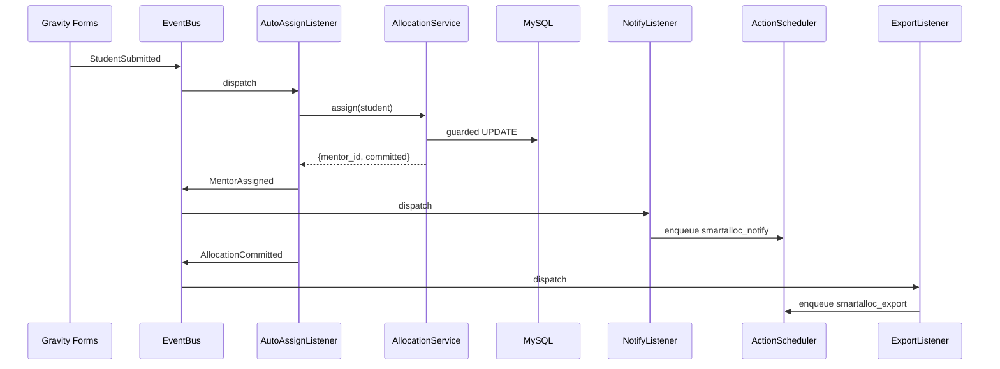
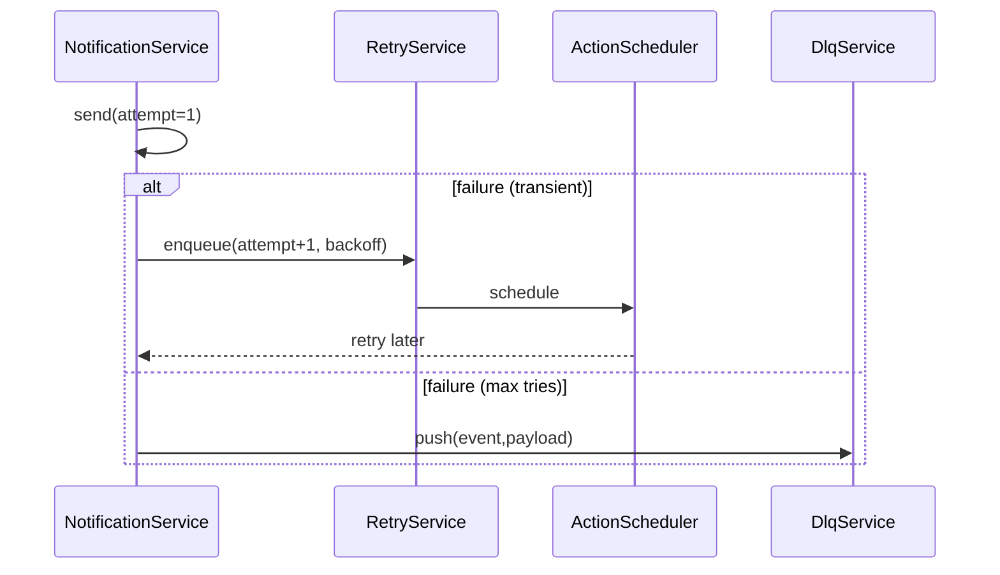

# سند اجرایی کامل افزونه تخصیص هوشمند — بروزرسانی ۱۶ شهریور ۱۴۰۴ (2025-09-07)


> این بروزرسانی بر اساس تصمیمات تازهٔ پروژه است: تثبیت Gravity Forms، مهاجرت صف به Action Scheduler، Mentor#39 به‌صورت Hybrid (GPPA اختیاری با Fallback داخلی)، SMTP فقط Prod، Rule-of-One (بدون نصب وب‌هوک‌های no‑code فعلاً)، سخت‌گیری UTC، تکمیل SchemaChecker، و افزودن Plugin Health به Site Health.

## 1) پیش‌نیازها (Prerequisites)
- **WordPress 6.4+**, PHP 8.1+، MySQL 8+/MariaDB 10.5+
- پلاگین‌ها (Dev/Prod):
  - **Gravity Forms** (قطعی)
  - **Action Scheduler** (قطعی)
  - **WP Mail SMTP** (فقط Prod؛ Dev صرفاً Mail Log)
  - **(اختیاری)** GP Populate Anything (برای فیلد Mentor#39 با Live/AJAX)
  - **(Dev-only)** Query Monitor, WP Crontrol
  - **(اختیاری زیرساخت)** Redis Object Cache (یا Object Cache Pro روی Redis موجود)
- فایل‌های پیکربندی پروژه:
  - `gf_form_import_SmartAlloc_v2.2.json` (نسخه 2.8؛ دارای تنظیمات GPPA روی فیلد 39)
  - `SmartAlloc_Exporter_Config_v1.json` (مسیر از Settings قابل تنظیم)

## 2) نصب و پیکربندی (Dev / Prod)
### 2.1 Dev
1. نصب و فعال‌سازی: Gravity Forms، Action Scheduler، (اختیاری) GPPA، Query Monitor، WP Crontrol.
2. ایمپورت فرم نمونه: از مسیر **SmartAlloc → Forms → Generate GF JSON** یا فایل `gf_form_import_SmartAlloc_v2.2.json`.
3. **Site Health → Plugin Health (سفارشی)** را بررسی کنید؛ همهٔ تست‌ها باید سبز باشند.
4. در Dev، **Mail Log** را فعال و PII را ماسک کنید؛ SMTP واقعی را تنظیم نکنید.

### 2.2 Prod
1. نصب و فعال‌سازی: Gravity Forms، Action Scheduler، WP Mail SMTP (با دامنه‌/DNS تأییدشده).
2. فعال‌سازی فرم/فرم‌ها از **SmartAlloc → Forms** و **Enable** کردنشان.
3. تنظیم کلیدها/اسرار (HMAC برای وب‌هوک داخلی، SMTP creds) در `wp-config.php`/Settings.
4. بررسی Site Health: Rule-of-One رعایت شده، نسخه‌ها حداقلی/سازگار، DLQ/AS سبز.

## 3) مسیر واحد سابمیشن GF (حذف دوگانگی)
- **تصمیم:** تنها یک مسیر برای `gform_after_submission` فعال باشد.
  - گزینهٔ منتخب: **رجیستری per-form** از `HookBootstrap` که برای فرم‌های Enabled هوک می‌زند:  
    `add_action("gform_after_submission_{$formId}", [SabtSubmissionHandler::class, 'handle'], 10, 2);`
- **اقدام:** مسیر generic (سراسری) را Deprecate/غیرفعال کنید تا **Double-Processing** رخ ندهد.
- **تست پذیرش:** ارسال یک نمونه؛ باید دقیقاً یک بار تخصیص انجام شود (لاگ تکراری = ۰).

## 4) Action Scheduler — مهاجرت صف
- **Groupها:** `smartalloc_allocate`, `smartalloc_export`, `smartalloc_notify`
- **Backoff نمایی (Retry):** 1m → 5m → 15m → 30m (حداکثر 4 تلاش)
- **DLQ:** استفاده از Failed Actions به‌عنوان DLQ؛ Replay از UI/اکشن ادمین داخلی.
- **Idempotency:** برای هر Entry یک `as_schedule_unique_action` روی کلید entry_id+مرحله.
- **KPIها:** Failed < ۱٪، p95 انتظار < ۱۰s، DLQ ≤ ۵.
- **Fallback:** WP-Cron فقط در شرایط اضطراری؛ باید در Site Health پرچم هشدار بخورد.

## 5) Mentor Populate (Field #39) — حالت Hybrid
- **بدون GPPA (Fallback داخلی):**
  - Populate سمت سرور با `gform_pre_render`/`gform_pre_validation` بر اساس فیلدهای وابسته (جنسیت=92، وضعیت=93، مرکز=94، پشتیبانی=75).
  - اگر مقدار فیلدهای وابسته تغییر کرد، بازسازی لیست در Request بعدی انجام می‌شود (بدون Live/AJAX).
- **با GPPA:**
  - پیکربندی Data Source/Filters در سازندهٔ فرم؛ Live/AJAX repopulate، جست‌وجو، صفحه‌بندی و کش خودکار.
  - توصیه: **Wrapper (GFBridge)** برای جداسازی تنظیمات و نگه‌داری مسیر خروج.
- **پذیرش:** در هر دو حالت، سیاست ظرفیت/رتبه‌بندی **در AllocationEngine** می‌ماند (UI فقط راهنما است).

## 6) ایمیل/اعلان
- **Prod:** WP Mail SMTP با SPF/DKIM/DMARC صحیح؛ لاگ خاموش یا PII ماسک‌شده.
- **Dev:** Mail Log فعال فقط برای دیباگ؛ ارسال واقعی نداشته باشید.
- **KPI:** Delivery ≥ ۹۸٪، Duplicate = ۰، p95 ارسال < ۳۰۰ms.

## 7) UTC و ذخیره‌سازی زمان
- **قانون:** ذخیرهٔ همهٔ timestampها به‌صورت UTC (`current_time('mysql', true)`/`gmdate()`/`current_time('timestamp', true)`).
- **نمایش:** تبدیل به منطقهٔ محلی صرفاً در UI.
- **تست:** Site Health باید هر استفاده از `current_time('mysql')` بدون GMT=true را پرچم کند.

## 8) SchemaChecker (واقعی‌سازی)
- بررسی وجود/نوع فیلدهای کلیدی (شناسه‌های حیاتی: 39, 20, 92, 93, 94, 75, …).
- تطبیق نسخهٔ JSON فرم با نسخهٔ GF سایت؛ هشدار mismatch.
- گزارش «Compatibility» در صفحهٔ **SmartAlloc → Forms** (ستون وضعیت).
- **KPI:** GF schema compatibility = **۱۰۰٪**.

## 9) Site Health — Plugin Health (سفارشی)
- تست‌های سبز لازم:
  - Gravity Forms فعال و نسخه ≥ مینیمم پروژه.
  - Action Scheduler فعال، Queue latency < 300ms، Failed actions ≤ آستانه.
  - Rule-of-One: عدم نصب همزمان WP Webhooks/Uncanny Automator (فعلاً ممنوع).
  - SMTP (Prod) تنظیم/تأیید شده؛ در Dev خاموش/Log فعال.
  - UTC invariant: هیچ استفادهٔ ناسازگار گزارش نشود.
- خروجی باید اقدام‌محور باشد (Recommendation با لینک به صفحهٔ مربوط).

## 10) JSON قالب فرم و ژنراتور
- فایل مرجع: `gf_form_import_SmartAlloc_v2.2.json` (نسخهٔ 2.8؛ شامل تنظیمات GPPA برای فیلد 39).
- ژنراتور داخلی (`GFFormGenerator`) فعلاً نسخهٔ 2.5.x می‌سازد.
- **تصمیم:** یا ژنراتور را به **2.8** ارتقا دهید، یا در سند ذکر کنید که ایمپورت با 2.5.x نیز تست شده و مورد تأیید است.
- **پیشنهاد:** ارتقای ژنراتور به 2.8 جهت حذف mismatch و ساده‌سازی پشتیبانی.

## 11) مسیرهای ادمین و دسترسی
- منوی «SmartAlloc» شامل: Forms, Allocation, Export, Reports, Settings, Logs, Debug.
- Capability الزامی: `manage_smartalloc` برای Import/Allocate/Export و تنظیمات حساس.
- Nonce/Referer برای تمام اکشن‌های ادمین الزامی.

## 12) CLI (اختیاری)
- تولید JSON فرم: `wp smartalloc gf generate --output=/path/form.json`
- اجرای تخصیص دسته‌ای: `wp smartalloc allocate --form=150 --dry-run`
- تولید خروجی: `wp smartalloc export --form=150`

## 13) KPIها و پذیرش (Acceptance)
- Queue: Failed < ۱٪، p95 انتظار < ۱۰s، DLQ ≤ ۵؛ Replay موفق ≥ ۹۹٪.
- Allocation: p95 < ۸۰ms، capacity deviation ≤ ۵٪، mentor conflict = ۰.
- Export: حافظه پیک < ۱۲۸MB، ساخت ≤ ۲s (@N≈1000)، CSV-Injection = ۰.
- Forms: خطای سابمیشن < ۰.۵٪، Compatibility = ۱۰۰٪.
- Comms: Delivery ≥ ۹۸٪، Duplicate = ۰.

## 14) کنترل ریسک و Rollback
- **Feature Flags:** فعال/غیرفعال‌سازی GPPA و سوییچ صف (AS/Cron) از Settings.
- **Rollback صف:** غیرفعال‌سازی AS و بازگشت به WP-Cron (در Site Health هشدار داده می‌شود).
- **ایزولاسیون افزونه‌ها:** در Staging با Health Check (Troubleshooting Mode) بررسی ناسازگاری.

## 15) تغییرات آمادهٔ Diff (Patch Guard ≤ 120 LoC)
- غیرفعال‌سازی مسیر generic `gform_after_submission` (Deprecate) — ~10 LoC
- افزودن گروه‌ها و backoff به ASBridge/Adapter — ~25 LoC
- تکمیل SchemaChecker (چک فیلدها + گزارش UI) — ~35 LoC
- Site Health: Plugin Health tests ثبت — ~30 LoC
- UTC سخت در ۲–۳ محل ذخیرهٔ زمان — ~10–15 LoC

---

---

## ضمیمه: نسخهٔ قبلی (برای مرجع)

# SmartAlloc — سند اجرایی کامل افزونه تخصیص خودکار پشتیبان (v1.0)

> هدف: افزونهٔ وردپرسی تولید-آماده برای تخصیص خودکار «پشتیبان» به «دانش‌آموز»، با معماری Event‑Driven، Command Pattern، DI Container، Cache سه‌لایه، Observability (Health, Metrics, Circuit Breaker) و ادغام کامل با Gravity Forms.

---

## فهرست

1. [معرفی و پیش‌نیازها](#intro)
2. [ساختار پوشه‌ها و فایل‌ها](#tree)
3. [فایل اصلی افزونه: ](#plugin-main)[`smart-alloc.php`](#plugin-main)
4. [Bootstrap و DI Container](#bootstrap)
5. [EventBus، ListenerInterface، Deduplication](#eventbus)
6. [CommandBus و دستورات اصلی](#commandbus)
7. [لایهٔ سرویس‌ها (Db/Cache/Logging/CircuitBreaker/Metrics/...)](#services)
8. [AllocationService: Rule Engine + Guarded UPDATE](#allocation-service)
9. [CounterService: شمارندهٔ اتمیک](#counter-service)
10. [CrosswalkService: کش و invalidation](#crosswalk-service)
11. [ExportService: تولید ImportToSabt.xlsx + خطاپذیری](#export-service)
12. [NotificationService + Circuit Breaker](#notification-service)
13. [Event Listeners (AutoAssign/LogActivity/Notify/Export)](#listeners)
14. [Gravity Forms Integration](#gf)
15. [Action Scheduler Adapter (Async Jobs)](#as)
16. [REST API: ](#rest)[`/smartalloc/v1/health`](#rest)[, ](#rest)[`/smartalloc/v1/metrics`](#rest)[, ](#rest)[`/smartalloc/v1/export`](#rest)
17. [Database Schema & Migrations](#db)
18. [Cache Strategy سه‌لایه](#cache)
19. [Observability & Monitoring](#observability)
20. [Security & Performance](#security)
21. [Testing & QA](#testing)
22. [Deployment & Operations](#ops)
23. [Troubleshooting & Maintenance](#troubleshooting)

---


## 1) معرفی و پیش‌نیازها

- WordPress ≥ 6.0، PHP ≥ 8.0، MySQL ≥ 8.0 (InnoDB)
- Gravity Forms Pro (فرم اصلی ثبت دانش‌آموز)
- (اختیاری ولی توصیه‌شده) Action Scheduler فعال
- دسترسی نوشتن در `/wp-content/uploads/smart-alloc/`

**الزامات امنیتی:** همهٔ ورودی‌ها sanitize و validate شوند؛ همهٔ SQLها `prepare`؛ کنترل دسترسی مبتنی بر `manage_smartalloc`.

---


## 2) ساختار پوشه‌ها و فایل‌ها

```
smart-alloc/
├─ smart-alloc.php                  # فایل اصلی افزونه (Bootstrap + Autoloader + Hooks)
├─ src/
│  ├─ Bootstrap.php                 # راه‌انداز، ثبت سرویس‌ها، Listenerها، REST
│  ├─ Container.php                 # DI Container ساده (PSR-11 Lite)
│  ├─ Contracts/
│  │  ├─ ListenerInterface.php
│  │  ├─ CommandInterface.php
│  │  └─ CommandHandlerInterface.php
│  ├─ Event/
│  │  ├─ EventBus.php
│  │  └─ EventKey.php               # سازندهٔ dedupe key
│  ├─ Command/
│  │  ├─ CommandBus.php
│  │  ├─ AssignMentorCommand.php
│  │  └─ RevertAllocationCommand.php
│  ├─ Services/
│  │  ├─ Db.php
│  │  ├─ Cache.php
│  │  ├─ Logging.php
│  │  ├─ CircuitBreaker.php
│  │  ├─ Metrics.php
│  │  ├─ CounterService.php
│  │  ├─ AllocationService.php
│  │  ├─ CrosswalkService.php
│  │  ├─ ExportService.php
│  │  ├─ NotificationService.php
│  │  ├─ StatsService.php           # L3 precomputed views
│  │  └─ HealthService.php
│  ├─ Listeners/
│  │  ├─ AutoAssignListener.php
│  │  ├─ LogActivityListener.php
│  │  ├─ NotifyListener.php
│  │  └─ ExportListener.php
│  ├─ Http/
│  │  └─ RestController.php
│  ├─ Integration/
│  │  ├─ GravityForms.php
│  │  └─ ActionSchedulerAdapter.php
│  └─ Utils/
│     ├─ Arr.php
│     └─ StrMask.php
├─ assets/
│  ├─ css/admin.css
│  └─ js/admin.js
├─ uninstall.php
└─ readme.txt
```

<a id="packages"></a>
## 2.1) تقسیم‌بندی بسته‌ها (Core / Services / Listeners+Integration / REST+Admin)

### چرا این تقسیم‌بندی؟
- **تحویل مرحله‌ای و تست‌پذیر**: هر بسته خروجی مستقل دارد (Core → Services → Integration → REST/Admin) و می‌توان E2E را زودتر سبز کرد.
- **پایداری هسته**: Core کوچک می‌ماند (Bootstrapping, DI, EventBus, EventKey, Contracts) و تغییرات دامنه فقط Services/Listeners را لمس می‌کند.
- **مدیریت ریسک و وابستگی‌ها**: وابستگی‌های سنگین (Gravity Forms, Action Scheduler, PhpSpreadsheet) از Core جدا هستند؛ خرابی Integration هسته را متوقف نمی‌کند.
- **کارایی و رصدپذیری**: Observability (Health/Metrics/Circuit Breaker) در Services پیاده می‌شود؛ EventBus مینیمال و سریع می‌ماند.

### محتویات هر بسته
- **Core**: `Bootstrap`, `Container`, `EventBus`, `EventKey`, `Contracts/*`  
  - *نکته*: EventBus فقط به قراردادهای عمومی وابسته باشد (Logger و EventStore). پیاده‌سازی وردپرسی این قراردادها در Services می‌آید.
- **Services**: `Db`, `Cache`, `Logging`, `Metrics`, `CircuitBreaker`, `AllocationService`, `CounterService`, `CrosswalkService`, `ExportService`, `HealthService`, `StatsService`  
  - آداپترهای عملیاتی Logger/EventStore برای WordPress اینجا پیاده می‌شوند (اتصال به `$wpdb`/`error_log`).
- **Listeners & Integration**: `AutoAssignListener`, `LogActivityListener`, `NotifyListener`, `ExportListener`, `GravityForms`, `ActionSchedulerAdapter`  
  - صف‌بندی کارهای زمان‌بر (Async) فقط از طریق این لایه انجام می‌شود.
- **REST & Admin**: `RestController` و صفحات ادمین.

### قوانین وابستگی (Dependency Rules)
- Core → فقط Contracts (بدون وابستگی به WordPress)
- Services → Core (+Contracts)
- Listeners/Integration → Services (+Core Contracts)
- REST/Admin → Services  
**منع**: هیچ لایه‌ای به لایهٔ بالاتر از خود وابسته نشود (No upward deps).

### نکات اجرایی کلیدی
- **PHP 8.0**: استفاده از کلاس‌کانست به‌جای Enum برای سازگاری.
- **Idempotency & Dedup**: کلید یکتا `{event}:{entry_id}:{version}` در EventKey؛ پردازش رویدادها idempotent.
- **Thread-Safety**: عملیات حساس در Services با Guarded UPDATE/atomic SQL.
- **Async**: Listenerهای زمان‌بر با Action Scheduler (یا fallback به WP‑Cron) در Integration.

### معیارهای آمادگی برای حرکت
- [x] Core بدون وابستگی به WordPress تست واحد می‌شود.
- [x] EventBus با قراردادهای Logger/EventStore کار می‌کند.
- [x] آداپتر Logger/EventStore در Services تزریق می‌شود.
- [x] مسیر GF→Event→Allocation→Export به‌صورت سرتاسری سبز است.

---


## 3) فایل اصلی افزونه: `smart-alloc.php`

```php
<?php
/**
 * Plugin Name: SmartAlloc – تخصیص خودکار پشتیبان
 * Description: Event-Driven auto-allocation with DI, Caching, Observability, and Gravity Forms integration.
 * Version: 1.0.0
 * Author: Your Team
 * Requires PHP: 8.0
 */

if (!defined('ABSPATH')) { exit; }

// === Constants ===
const SMARTALLOC_VERSION = '1.0.0';
const SMARTALLOC_MIN_PHP = '8.0.0';
const SMARTALLOC_CAP = 'manage_smartalloc';
const SMARTALLOC_UPLOAD_DIR = 'smart-alloc';

// === PHP version check ===
if (version_compare(PHP_VERSION, SMARTALLOC_MIN_PHP, '<')) {
    add_action('admin_notices', function(){
        echo '<div class="notice notice-error"><p>SmartAlloc requires PHP ' . esc_html(SMARTALLOC_MIN_PHP) . '+.</p></div>';
    });
    return;
}

// === PSR-4 Autoloader (no Composer) ===
spl_autoload_register(function($class){
    $prefix = 'SmartAlloc\\';
    $base_dir = __DIR__ . '/src/';
    if (strncmp($prefix, $class, strlen($prefix)) !== 0) return;
    $rel = substr($class, strlen($prefix));
    $file = $base_dir . str_replace('\\', '/', $rel) . '.php';
    if (is_readable($file)) require $file;
});

// === Activation / Uninstall ===
register_activation_hook(__FILE__, function(){
    SmartAlloc\Bootstrap::activate();
});

register_uninstall_hook(__FILE__, 'SmartAlloc\\Bootstrap::uninstall');

// === Bootstrap on plugins_loaded ===
add_action('plugins_loaded', function(){
    SmartAlloc\Bootstrap::init();
});
```

---


## 4) Bootstrap و DI Container

```php
<?php
namespace SmartAlloc;

use SmartAlloc\Services\{Db, Cache, Logging, CircuitBreaker, Metrics, CounterService, AllocationService, CrosswalkService, ExportService, NotificationService, StatsService, HealthService};
use SmartAlloc\Event\EventBus;
use SmartAlloc\Http\RestController;
use SmartAlloc\Integration\{GravityForms, ActionSchedulerAdapter};

final class Bootstrap
{
    private static ?Container $c = null;

    public static function init(): void
    {
        if (self::$c) return; // idempotent
        self::$c = new Container();

        // Base services
        self::$c->set(Db::class, fn() => new Db());
        self::$c->set(Cache::class, fn() => new Cache());
        self::$c->set(Logging::class, fn() => new Logging());
        self::$c->set(CircuitBreaker::class, fn() => new CircuitBreaker());
        self::$c->set(Metrics::class, fn() => new Metrics());
        self::$c->set(EventBus::class, fn() => new EventBus(self::$c->get(Logging::class), self::$c->get(Db::class)));
        self::$c->set(ActionSchedulerAdapter::class, fn() => new ActionSchedulerAdapter());

        // Domain services
        self::$c->set(CounterService::class, fn() => new CounterService(self::$c->get(Db::class), self::$c->get(Logging::class)));
        self::$c->set(CrosswalkService::class, fn() => new CrosswalkService(self::$c->get(Db::class), self::$c->get(Cache::class), self::$c->get(Logging::class)));
        self::$c->set(AllocationService::class, fn() => new AllocationService(self::$c->get(Db::class), self::$c->get(CrosswalkService::class), self::$c->get(Logging::class)));
        self::$c->set(ExportService::class, fn() => new ExportService(self::$c->get(Db::class), self::$c->get(Logging::class)));
        self::$c->set(NotificationService::class, fn() => new NotificationService(self::$c->get(CircuitBreaker::class), self::$c->get(Logging::class)));
        self::$c->set(StatsService::class, fn() => new StatsService(self::$c->get(Db::class), self::$c->get(Logging::class)));
        self::$c->set(HealthService::class, fn() => new HealthService(self::$c->get(Db::class), self::$c->get(Cache::class)));

        // REST
        (new RestController(self::$c))->register_routes();

        // Integration
        (new GravityForms(self::$c))->register();

        // Listeners wiring
        self::wireListeners();
    }

    public static function container(): Container { return self::$c; }

    private static function wireListeners(): void
    {
        $bus = self::$c->get(EventBus::class);
        $bus->on('StudentSubmitted', new \SmartAlloc\Listeners\AutoAssignListener(self::$c));
        $bus->on('StudentSubmitted', new \SmartAlloc\Listeners\LogActivityListener(self::$c));
        $bus->on('MentorAssigned',   new \SmartAlloc\Listeners\NotifyListener(self::$c));
        $bus->on('AllocationCommitted', new \SmartAlloc\Listeners\ExportListener(self::$c));
    }

    public static function activate(): void
    {
        // DB Migrations
        Services\Db::migrate();
        // Upload dir
        $upload = wp_upload_dir();
        wp_mkdir_p(trailingslashit($upload['basedir']) . SMARTALLOC_UPLOAD_DIR);
    }

    public static function uninstall(): void
    {
        // اختیاری: پاک‌سازی جداول/آپشن‌ها
    }
}
```

**Container ساده:**

```php
<?php
namespace SmartAlloc;

final class Container
{
    /** @var array<string, callable> */
    private array $defs = [];
    /** @var array<string, mixed> */
    private array $instances = [];

    public function set(string $id, callable $factory): void { $this->defs[$id] = $factory; }
    public function get(string $id): mixed
    {
        if (!isset($this->instances[$id])) {
            if (!isset($this->defs[$id])) throw new \RuntimeException("Service not found: $id");
            $this->instances[$id] = ($this->defs[$id])();
        }
        return $this->instances[$id];
    }
}
```

---


## 5) EventBus، ListenerInterface، Deduplication

**اینترفیس Listener:**

```php
<?php
namespace SmartAlloc\Contracts;

interface ListenerInterface
{
    public function handle(string $event, array $payload): void;
}
```

**EventKey ساز:**

```php
<?php
namespace SmartAlloc\Event;

final class EventKey
{
    public static function make(string $event, array $payload, string $version = 'v1'): string
    {
        $entry = $payload['entry_id'] ?? ($payload['id'] ?? uniqid('', true));
        return $event . ':' . $entry . ':' . $version;
    }
}
```

**EventBus با Dedup (جدول **``**):**

```php
<?php
namespace SmartAlloc\Event;

use SmartAlloc\Contracts\ListenerInterface;
use SmartAlloc\Services\{Logging, Db};

final class EventBus
{
    /** @var array<string, ListenerInterface[]> */
    private array $listeners = [];
    public function __construct(private Logging $log, private Db $db) {}

    public function on(string $event, ListenerInterface $listener): void
    {
        $this->listeners[$event][] = $listener;
    }

    public function dispatch(string $event, array $payload, string $version = 'v1'): void
    {
        $key = EventKey::make($event, $payload, $version);
        $eid = $this->db->insertEventIfNotExists($event, $key, $payload);
        if ($eid === 0) {
            $this->log->info('event.duplicate', ['event' => $event, 'key' => $key]);
            return; // dedup hit
        }
        $this->log->info('event.start', ['event' => $event, 'key' => $key]);
        $start = microtime(true);
        foreach ($this->listeners[$event] ?? [] as $l) {
            $lname = get_class($l);
            $lid = $this->db->startListenerRun($eid, $lname);
            try {
                $l->handle($event, $payload);
                $this->db->finishListenerRun($lid, 'completed', null);
            } catch (\Throwable $e) {
                $this->db->finishListenerRun($lid, 'failed', $e->getMessage());
                $this->log->error('listener.error', ['event'=>$event,'listener'=>$lname,'err'=>$e->getMessage()]);
                // ادامه اجرای دیگر listenerها
            }
        }
        $dur = (int) round((microtime(true) - $start) * 1000);
        $this->db->finishEvent($eid, 'completed', null, $dur);
    }
}
```

---


## 6) CommandBus و دستورات اصلی

**قراردادها:**

```php
<?php
namespace SmartAlloc\Contracts;

interface CommandInterface {}
interface CommandHandlerInterface { public function __invoke(CommandInterface $cmd): mixed; }
```

**CommandBus با Decorators ساده:**

```php
<?php
namespace SmartAlloc\Command;

use SmartAlloc\Contracts\{CommandInterface, CommandHandlerInterface};
use SmartAlloc\Services\{Logging, Metrics, CircuitBreaker};

final class CommandBus
{
    public function __construct(private Logging $log, private Metrics $metrics, private CircuitBreaker $cb) {}

    /** @param array<string, CommandHandlerInterface> $handlers */
    public function handle(CommandInterface $cmd, array $handlers): mixed
    {
        $name = get_class($cmd);
        $this->cb->guard("cmd:$name");
        $t0 = microtime(true);
        try {
            $handler = $handlers[$name] ?? null;
            if (!$handler) throw new \RuntimeException("No handler for $name");
            $res = $handler($cmd);
            $this->metrics->inc('cmd_success_total', 1, ['cmd'=>$name]);
            return $res;
        } catch (\Throwable $e) {
            $this->metrics->inc('cmd_failed_total', 1, ['cmd'=>$name]);
            $this->log->error('cmd.error', ['cmd'=>$name,'err'=>$e->getMessage()]);
            throw $e;
        } finally {
            $this->metrics->observe('cmd_duration_ms', (int) round((microtime(true)-$t0)*1000), ['cmd'=>$name]);
        }
    }
}
```

**AssignMentorCommand و Revert:**

```php
<?php
namespace SmartAlloc\Command;

use SmartAlloc\Contracts\CommandInterface;

final class AssignMentorCommand implements CommandInterface
{
    public function __construct(public array $student) {}
}

final class RevertAllocationCommand implements CommandInterface
{
    public function __construct(public int $alloc_id) {}
}
```

---


## 7) لایهٔ سرویس‌ها (Db/Cache/Logging/CircuitBreaker/Metrics/...)

**Db (wrapper امن + migrations + روال‌های EventLog):**

```php
<?php
namespace SmartAlloc\Services;

class Db
{
    private \wpdb $db;
    public function __construct() { global $wpdb; $this->db = $wpdb; }
    public static function migrate(): void
    {
        global $wpdb; $charset = $wpdb->get_charset_collate();
        require_once ABSPATH . 'wp-admin/includes/upgrade.php';
        $p = $wpdb->prefix;

        $sql = [];
        $sql[] = "CREATE TABLE {$p}salloc_event_log (
            id BIGINT UNSIGNED AUTO_INCREMENT PRIMARY KEY,
            event_name VARCHAR(100) NOT NULL,
            dedupe_key VARCHAR(191) NOT NULL,
            payload LONGTEXT NULL,
            status ENUM('started','completed','failed') NOT NULL DEFAULT 'started',
            error_text TEXT NULL,
            duration_ms INT UNSIGNED NULL,
            started_at DATETIME NOT NULL DEFAULT CURRENT_TIMESTAMP,
            finished_at DATETIME NULL,
            UNIQUE KEY uniq_dedupe (dedupe_key),
            KEY idx_event (event_name, started_at)
        ) $charset";

        $sql[] = "CREATE TABLE {$p}salloc_event_listener_log (
            id BIGINT UNSIGNED AUTO_INCREMENT PRIMARY KEY,
            event_log_id BIGINT UNSIGNED NOT NULL,
            listener VARCHAR(191) NOT NULL,
            status ENUM('started','completed','failed') NOT NULL DEFAULT 'started',
            error_text TEXT NULL,
            duration_ms INT UNSIGNED NULL,
            created_at DATETIME NOT NULL DEFAULT CURRENT_TIMESTAMP,
            KEY idx_event_listener (event_log_id, listener)
        ) $charset";

        $sql[] = "CREATE TABLE {$p}salloc_alloc_history (
            id BIGINT UNSIGNED AUTO_INCREMENT PRIMARY KEY,
            student_id BIGINT UNSIGNED NOT NULL,
            prev_mentor_id BIGINT UNSIGNED NULL,
            new_mentor_id BIGINT UNSIGNED NOT NULL,
            performed_by VARCHAR(100) NULL,
            created_at DATETIME NOT NULL DEFAULT CURRENT_TIMESTAMP,
            KEY idx_student (student_id, created_at)
        ) $charset";

        $sql[] = "CREATE TABLE {$p}salloc_stats_daily (
            stat_date DATE NOT NULL,
            manager_id BIGINT UNSIGNED NULL,
            center_id BIGINT UNSIGNED NULL,
            gender CHAR(1) NULL,
            group_code VARCHAR(50) NULL,
            capacity INT UNSIGNED NOT NULL DEFAULT 0,
            assigned INT UNSIGNED NOT NULL DEFAULT 0,
            PRIMARY KEY (stat_date, manager_id, center_id, gender, group_code)
        ) $charset";

        $sql[] = "CREATE TABLE {$p}salloc_metrics (
            id BIGINT UNSIGNED AUTO_INCREMENT PRIMARY KEY,
            metric_key VARCHAR(100) NOT NULL,
            labels TEXT NULL,
            ts DATETIME NOT NULL DEFAULT CURRENT_TIMESTAMP,
            value DOUBLE NOT NULL,
            KEY idx_metric_time (metric_key, ts)
        ) $charset";

        $sql[] = "CREATE TABLE {$p}salloc_export_log (
            id BIGINT UNSIGNED AUTO_INCREMENT PRIMARY KEY,
            file_name VARCHAR(255) NOT NULL,
            status ENUM('started','completed','failed') NOT NULL DEFAULT 'started',
            rows_ok INT UNSIGNED DEFAULT 0,
            rows_error INT UNSIGNED DEFAULT 0,
            started_at DATETIME NOT NULL DEFAULT CURRENT_TIMESTAMP,
            finished_at DATETIME NULL,
            error_text TEXT NULL,
            KEY idx_status_time (status, started_at)
        ) $charset";

        $sql[] = "CREATE TABLE {$p}salloc_export_errors (
            id BIGINT UNSIGNED AUTO_INCREMENT PRIMARY KEY,
            export_id BIGINT UNSIGNED NOT NULL,
            row_index INT UNSIGNED NOT NULL,
            column_name VARCHAR(100) NULL,
            message TEXT NOT NULL,
            KEY idx_export (export_id)
        ) $charset";

        $sql[] = "CREATE TABLE {$p}salloc_circuit_breakers (
            name VARCHAR(100) NOT NULL PRIMARY KEY,
            state ENUM('closed','open','half_open') NOT NULL DEFAULT 'closed',
            failures INT UNSIGNED NOT NULL DEFAULT 0,
            last_failure_at DATETIME NULL,
            reset_at DATETIME NULL
        ) $charset";

        foreach ($sql as $s) { dbDelta($s); }
    }

    public function startTransaction(): void { $this->db->query('START TRANSACTION'); }
    public function commit(): void { $this->db->query('COMMIT'); }
    public function rollback(): void { $this->db->query('ROLLBACK'); }

    public function insertEventIfNotExists(string $event, string $key, array $payload): int
    {
        $row = [
            'event_name' => $event,
            'dedupe_key' => $key,
            'payload'    => wp_json_encode($payload),
            'status'     => 'started',
        ];
        $table = $this->db->prefix . 'salloc_event_log';
        $res = $this->db->insert($table, $row);
        if ($res === false) {
            // اگر duplicate بود، 0 برگردانیم
            if (str_contains(strtolower($this->db->last_error), 'duplicate')) return 0;
            throw new \RuntimeException('DB insertEvent error: ' . $this->db->last_error);
        }
        return (int) $this->db->insert_id;
    }

    public function finishEvent(int $id, string $status, ?string $err, int $durationMs): void
    {
        $table = $this->db->prefix . 'salloc_event_log';
        $this->db->update($table, [
            'status' => $status,
            'error_text' => $err,
            'duration_ms' => $durationMs,
            'finished_at' => current_time('mysql'),
        ], ['id' => $id]);
    }

    public function startListenerRun(int $eventLogId, string $listener): int
    {
        $table = $this->db->prefix . 'salloc_event_listener_log';
        $res = $this->db->insert($table, [
            'event_log_id' => $eventLogId,
            'listener'     => $listener,
            'status'       => 'started',
        ]);
        if ($res === false) throw new \RuntimeException('DB listener start error: ' . $this->db->last_error);
        return (int) $this->db->insert_id;
    }

    public function finishListenerRun(int $id, string $status, ?string $err): void
    {
        $table = $this->db->prefix . 'salloc_event_listener_log';
        $this->db->update($table, [
            'status' => $status,
            'error_text' => $err,
            'duration_ms' => null,
        ], ['id' => $id]);
    }

    public function query(string $sql, array $params = []): array
    {
        $prepared = $params ? $this->db->prepare($sql, $params) : $sql;
        $rows = $this->db->get_results($prepared, ARRAY_A);
        if ($rows === null && $this->db->last_error) throw new \RuntimeException('DB query error: ' . $this->db->last_error);
        return $rows ?? [];
    }

    public function exec(string $sql, array $params = []): int
    {
        $prepared = $params ? $this->db->prepare($sql, $params) : $sql;
        $res = $this->db->query($prepared);
        if ($res === false) throw new \RuntimeException('DB exec error: ' . $this->db->last_error);
        return (int) $this->db->rows_affected;
    }
}
```

**Cache (L1/L2/L3 helpers):**

```php
<?php
namespace SmartAlloc\Services;

class Cache
{
    public function l1Get(string $key): mixed { return wp_cache_get($key, 'smartalloc'); }
    public function l1Set(string $key, mixed $value, int $ttl = 300): bool { return wp_cache_set($key, $value, 'smartalloc', $ttl); }
    public function l1Del(string $key): bool { return wp_cache_delete($key, 'smartalloc'); }

    public function l2Get(string $key): mixed { return get_transient($key); }
    public function l2Set(string $key, mixed $value, int $ttl = 600): bool { return set_transient($key, $value, $ttl); }
    public function l2Del(string $key): bool { return delete_transient($key); }
}
```

**Logging (masking حساس):**

```php
<?php
namespace SmartAlloc\Services;

final class Logging
{
    public function info(string $msg, array $ctx = []): void { $this->log('INFO', $msg, $ctx); }
    public function error(string $msg, array $ctx = []): void { $this->log('ERROR', $msg, $ctx); }

    private function log(string $level, string $msg, array $ctx): void
    {
        $masked = $this->mask($ctx);
        error_log('[SmartAlloc]['.$level.'] ' . $msg . ' ' . wp_json_encode($masked));
    }

    private function mask(array $ctx): array
    {
        $maskKeys = ['national_id','phone','mobile'];
        foreach ($maskKeys as $k) if (isset($ctx[$k])) $ctx[$k] = substr((string)$ctx[$k], 0, 3) . '***';
        return $ctx;
    }
}
```

**Circuit Breaker:**

```php
<?php
namespace SmartAlloc\Services;

final class CircuitBreaker
{
    private string $table;
    public function __construct() { global $wpdb; $this->table = $wpdb->prefix.'salloc_circuit_breakers'; }

    public function guard(string $name): void
    {
        $st = $this->state($name);
        if ($st['state'] === 'open' && (time() < strtotime((string)$st['reset_at']))) {
            throw new \RuntimeException("Circuit open: $name");
        }
    }

    public function success(string $name): void
    {
        $this->set($name, 'closed', 0, null, null);
    }

    public function failure(string $name, int $threshold = 5, int $cooldownSec = 60): void
    {
        $st = $this->state($name);
        $fail = ((int)$st['failures']) + 1;
        if ($fail >= $threshold) {
            $this->set($name, 'open', $fail, current_time('mysql'), gmdate('Y-m-d H:i:s', time()+$cooldownSec));
        } else {
            $this->set($name, 'half_open', $fail, current_time('mysql'), null);
        }
    }

    private function state(string $name): array
    {
        global $wpdb; $row = $wpdb->get_row($wpdb->prepare("SELECT * FROM {$this->table} WHERE name=%s", $name), ARRAY_A);
        if (!$row) return ['state'=>'closed','failures'=>0,'last_failure_at'=>null,'reset_at'=>null];
        return $row;
    }

    private function set(string $name, string $state, int $failures, ?string $last, ?string $reset): void
    {
        global $wpdb; $wpdb->replace($this->table, [
            'name'=>$name,'state'=>$state,'failures'=>$failures,'last_failure_at'=>$last,'reset_at'=>$reset
        ]);
    }
}
```

**Metrics (counter/observe):**

```php
<?php
namespace SmartAlloc\Services;

final class Metrics
{
    private string $table;
    public function __construct() { global $wpdb; $this->table = $wpdb->prefix.'salloc_metrics'; }

    public function inc(string $key, float $val = 1.0, array $labels = []): void
    {
        global $wpdb; $wpdb->insert($this->table, [
            'metric_key' => $key,
            'labels' => wp_json_encode($labels),
            'value' => $val,
        ]);
    }

    public function observe(string $key, int $ms, array $labels = []): void
    {
        $this->inc($key, (float)$ms, $labels);
    }
}
```

---


## 8) AllocationService: Rule Engine + Guarded UPDATE

```php
<?php
namespace SmartAlloc\Services;

final class AllocationService
{
    public function __construct(private Db $db, private CrosswalkService $xw, private Logging $log) {}

    /**
     * انتخاب پشتیبان و commit امن.
     * @param array $student [id, gender, group_code, schools[], center, ...]
     * @return array {mentor_id, committed:bool}
     */
    public function assign(array $student): array
    {
        $cands = $this->selectCandidates($student);
        foreach ($cands as $m) {
            // Guarded UPDATE برای رزرو ظرفیت
            $rows = $this->db->exec(
                "UPDATE {$this->mentorsTable()} SET assigned = assigned + 1
                 WHERE mentor_id = %d AND assigned < capacity",
                [ (int)$m['mentor_id'] ]
            );
            if ($rows === 1) {
                // ثبت سابقه
                $this->db->exec(
                    "INSERT INTO {$this->historyTable()} (student_id, prev_mentor_id, new_mentor_id, performed_by) VALUES (%d, %s, %d, %s)",
                    [ (int)$student['id'], null, (int)$m['mentor_id'], 'system' ]
                );
                do_action('smartalloc/mentor_assigned', $student, $m);
                return ['mentor_id' => (int)$m['mentor_id'], 'committed' => true];
            }
        }
        $this->log->error('alloc.no_capacity', ['student'=>$student['id']??null]);
        return ['mentor_id' => 0, 'committed' => false];
    }

    /**
     * انتخاب کاندیدها با EXISTS Rule Engine (نمونه ساده؛ قابل جایگزینی با VIEW)
     */
    private function selectCandidates(array $s): array
    {
        $sql = "SELECT m.mentor_id, m.assigned, m.capacity
                FROM {$this->mentorsTable()} m
                WHERE m.gender = %s
                  AND m.center_id = %d
                  AND m.active = 1
                  AND m.assigned < m.capacity
                ORDER BY (m.assigned / NULLIF(m.capacity,0)) ASC, m.allocations_new ASC, m.mentor_id ASC
                LIMIT 10";
        return $this->db->query($sql, [ $s['gender'] ?? 'U', (int)($s['center'] ?? 0) ]);
    }

    private function mentorsTable(): string { global $wpdb; return $wpdb->prefix.'salloc_mentors'; }
    private function historyTable(): string { global $wpdb; return $wpdb->prefix.'salloc_alloc_history'; }
}
```

> نکته: اگر میزبان اجازهٔ VIEW بدهد، می‌توان `v_salloc_candidates` ساخت و در `selectCandidates` فقط از آن view خواند.

---


## 9) CounterService: شمارندهٔ اتمیک

```php
<?php
namespace SmartAlloc\Services;

final class CounterService
{
    public function __construct(private Db $db, private Logging $log) {}

    /**
     * افزایش شمارندهٔ thread-safe بر اساس scope (مثلاً جنسیت/مرکز)
     */
    public function next(string $scope): int
    {
        // جدول پیشنهادی: wp_salloc_counters(scope VARCHAR PK, val BIGINT)
        global $wpdb; $t = $wpdb->prefix.'salloc_counters';
        $aff = $this->db->exec("INSERT INTO $t(scope, val) VALUES(%s, 1) ON DUPLICATE KEY UPDATE val = LAST_INSERT_ID(val+1)", [$scope]);
        // LAST_INSERT_ID با ON DUP KEY مقدار جدید را در insert_id می‌گذارد
        $id = (int)$wpdb->insert_id;
        if ($id <= 0) throw new \RuntimeException('counter failed');
        return $id;
    }
}
```

---


## 10) CrosswalkService: کش و invalidation

```php
<?php
namespace SmartAlloc\Services;

final class CrosswalkService
{
    public function __construct(private Db $db, private Cache $cache, private Logging $log) {}

    public function schoolCodeByName(string $name): int
    {
        $key = 'salloc:xwalk:v1:school:' . md5($name);
        $hit = $this->cache->l1Get($key);
        if ($hit !== false && $hit !== null) return (int)$hit;
        $row = $this->db->query("SELECT code FROM {$this->xwSchoolTable()} WHERE name = %s LIMIT 1", [$name]);
        $code = (int)($row[0]['code'] ?? 0);
        $this->cache->l1Set($key, $code, 3600);
        return $code;
    }

    public function invalidate(): void
    {
        // در عمل: generation bump در کلیدها (با افزایش نسخه)
    }

    private function xwSchoolTable(): string { global $wpdb; return $wpdb->prefix.'salloc_xw_school'; }
}
```

---


## 11) ExportService: تولید ImportToSabt.xlsx + خطاپذیری

```php
<?php
namespace SmartAlloc\Services;

final class ExportService
{
    public function __construct(private Db $db, private Logging $log) {}

    public function exportSabt(array $rows): string
    {
        if (!class_exists('PhpOffice\\PhpSpreadsheet\\Spreadsheet')) {
            throw new \RuntimeException('PhpSpreadsheet not found. Please install/activate dependency.');
        }
        $upload = wp_upload_dir();
        $dir = trailingslashit($upload['basedir']) . SMARTALLOC_UPLOAD_DIR;
        wp_mkdir_p($dir);
        $fname = sprintf('SabtExport-ALLOCATED-%s-%04d-B%03d.xlsx', gmdate('Y_m_d'), random_int(1,9999), random_int(1,999));
        $path = trailingslashit($dir) . $fname;

        $expId = $this->startExport($fname);
        try {
            $ss = new \PhpOffice\PhpSpreadsheet\Spreadsheet();
            $ws = $ss->getActiveSheet();
            // Header نمونه (طبق excel-schema.json واقعی جایگزین کنید)
            $headers = ['mentor_id','alias_code','center_code','gender','group_code','school_code','student_name','national_id','counter'];
            foreach ($headers as $i => $h) { $ws->setCellValueByColumnAndRow($i+1, 1, $h); }

            $rowIdx = 2; $ok=0; $err=0;
            foreach ($rows as $r) {
                try {
                    $this->validateRow($r);
                    foreach (array_values($headers) as $i => $col) {
                        $ws->setCellValueByColumnAndRow($i+1, $rowIdx, $r[$col] ?? '');
                    }
                    $ok++; $rowIdx++;
                } catch (\Throwable $e) {
                    $this->logError($expId, $rowIdx, 'row', $e->getMessage());
                    $err++; $rowIdx++;
                }
            }

            $writer = new \PhpOffice\PhpSpreadsheet\Writer\Xlsx($ss);
            $writer->save($path);
            $this->finishExport($expId, 'completed', $ok, $err, null);
            return $path;
        } catch (\Throwable $e) {
            $this->finishExport($expId, 'failed', 0, 0, $e->getMessage());
            throw $e;
        }
    }

    private function validateRow(array $r): void
    {
        if (empty($r['mentor_id'])) throw new \InvalidArgumentException('mentor_id required');
        if (!preg_match('/^\d{10}$/', (string)($r['national_id'] ?? ''))) throw new \InvalidArgumentException('invalid national_id');
    }

    private function startExport(string $fname): int
    {
        global $wpdb; $t = $wpdb->prefix.'salloc_export_log';
        $wpdb->insert($t, ['file_name'=>$fname,'status'=>'started']);
        return (int)$wpdb->insert_id;
    }

    private function finishExport(int $id, string $status, int $ok, int $err, ?string $msg): void
    {
        global $wpdb; $t = $wpdb->prefix.'salloc_export_log';
        $wpdb->update($t, [
            'status'=>$status,'rows_ok'=>$ok,'rows_error'=>$err,'finished_at'=>current_time('mysql'),'error_text'=>$msg
        ], ['id'=>$id]);
    }

    private function logError(int $expId, int $rowIndex, string $col, string $msg): void
    {
        global $wpdb; $t = $wpdb->prefix.'salloc_export_errors';
        $wpdb->insert($t, ['export_id'=>$expId,'row_index'=>$rowIndex,'column_name'=>$col,'message'=>$msg]);
    }
}
```

---


## 12) NotificationService + Circuit Breaker

```php
<?php
namespace SmartAlloc\Services;

final class NotificationService
{
    public function __construct(private CircuitBreaker $cb, private Logging $log) {}

    public function send(array $payload): void
    {
        $name = 'notify';
        try {
            $this->cb->guard($name);
            // TODO: ارسال ایمیل/SMS/وب‌هوک
            $this->cb->success($name);
        } catch (\Throwable $e) {
            $this->cb->failure($name);
            $this->log->error('notify.error', ['err'=>$e->getMessage()]);
        }
    }
}
```

---


## 13) Event Listeners (AutoAssign/LogActivity/Notify/Export)

```php
<?php
namespace SmartAlloc\Listeners;

use SmartAlloc\Contracts\ListenerInterface;
use SmartAlloc\Command\{CommandBus, AssignMentorCommand};
use SmartAlloc\Services\{AllocationService, Logging, ExportService, NotificationService};
use SmartAlloc\Container;

final class AutoAssignListener implements ListenerInterface
{
    public function __construct(private Container $c) {}
    public function handle(string $event, array $payload): void
    {
        $bus = new CommandBus($this->c->get(Logging::class), $this->c->get(\SmartAlloc\Services\Metrics::class), $this->c->get(\SmartAlloc\Services\CircuitBreaker::class));
        $cmd = new AssignMentorCommand($payload['student'] ?? $payload);
        $res = $bus->handle($cmd, [ AssignMentorCommand::class => function($cmd){
            $svc = $this->c->get(AllocationService::class);
            return $svc->assign($cmd->student);
        }]);
        if (!empty($res['committed'])) do_action('smartalloc/event', 'MentorAssigned', ['student'=>$payload,'mentor_id'=>$res['mentor_id']]);
    }
}

final class LogActivityListener implements ListenerInterface
{
    public function __construct(private Container $c) {}
    public function handle(string $event, array $payload): void
    {
        $this->c->get(Logging::class)->info('activity', ['event'=>$event,'payload'=>$payload]);
    }
}

final class NotifyListener implements ListenerInterface
{
    public function __construct(private Container $c) {}
    public function handle(string $event, array $payload): void
    {
        $this->c->get(NotificationService::class)->send($payload);
    }
}

final class ExportListener implements ListenerInterface
{
    public function __construct(private Container $c) {}
    public function handle(string $event, array $payload): void
    {
        if ($event !== 'AllocationCommitted') return;
        $rows = $payload['rows'] ?? [];
        if (!$rows) return;
        $this->c->get(ExportService::class)->exportSabt($rows);
    }
}
```

---


## 14) Gravity Forms Integration

```php
<?php
namespace SmartAlloc\Integration;

use SmartAlloc\Container;
use SmartAlloc\Event\EventBus;

final class GravityForms
{
    public function __construct(private Container $c) {}

    public function register(): void
    {
        // به‌صورت نمونه برای فرم ID=150 (از تنظیمات دریافت شود)
        add_action('gform_after_submission_150', function($entry){
            $payload = [
                'entry_id' => (int)$entry['id'],
                'student'  => [
                    'id' => (int)$entry['id'],
                    'gender' => rgar($entry,'92'),
                    'group_code' => rgar($entry,'93'),
                    'center' => (int) rgar($entry,'94'),
                    'schools' => [ rgar($entry,'school_1'), rgar($entry,'school_2') ],
                    'national_id' => rgar($entry,'national_id'),
                ]
            ];
            $this->c->get(EventBus::class)->dispatch('StudentSubmitted', $payload);
        }, 10, 1);
    }
}
```

---


## 15) Action Scheduler Adapter (Async Jobs)

```php
<?php
namespace SmartAlloc\Integration;

final class ActionSchedulerAdapter
{
    public function enqueue(string $hook, array $args = []): void
    {
        if (class_exists('ActionScheduler')) {
            as_enqueue_async_action($hook, $args, 'smartalloc');
        } else {
            // fallback به WP-Cron
            wp_schedule_single_event(time()+5, $hook, $args);
        }
    }
}
```

---


## 16) REST API: Health / Metrics / Export

```php
<?php
namespace SmartAlloc\Http;

use SmartAlloc\Container;
use SmartAlloc\Services\{HealthService, Metrics, ExportService};

final class RestController
{
    public function __construct(private Container $c) {}

    public function register_routes(): void
    {
        add_action('rest_api_init', function(){
            register_rest_route('smartalloc/v1', '/health', [
                'methods' => 'GET',
                'permission_callback' => '__return_true',
                'callback' => function(){ return $this->c->get(HealthService::class)->status(); }
            ]);
            register_rest_route('smartalloc/v1', '/metrics', [
                'methods' => 'GET',
                'permission_callback' => function(){ return current_user_can(SMARTALLOC_CAP); },
                'callback' => function(){ return $this->metrics(); }
            ]);
            register_rest_route('smartalloc/v1', '/export', [
                'methods' => 'POST',
                'permission_callback' => function(){ return current_user_can(SMARTALLOC_CAP); },
                'callback' => function($req){
                    $rows = $req->get_param('rows') ?: [];
                    $path = $this->c->get(ExportService::class)->exportSabt($rows);
                    return [ 'ok'=>true, 'file'=>$path ];
                }
            ]);
        });
    }

    private function metrics(): array
    {
        global $wpdb; $t = $wpdb->prefix.'salloc_metrics';
        $rows = $wpdb->get_results("SELECT metric_key, COUNT(*) c FROM $t GROUP BY 1 ORDER BY 1", ARRAY_A);
        return $rows ?: [];
    }
}
```

**HealthService:**

```php
<?php
namespace SmartAlloc\Services;

final class HealthService
{
    public function __construct(private Db $db, private Cache $cache) {}

    public function status(): array
    {
        $dbOk = true; $cacheOk = true; $notes = [];
        try { $this->db->query('SELECT 1'); } catch (\Throwable $e) { $dbOk=false; $notes[]=$e->getMessage(); }
        $this->cache->l1Set('health.test', 'ok', 5); $cacheOk = ($this->cache->l1Get('health.test')==='ok');
        return [ 'db'=>$dbOk, 'cache'=>$cacheOk, 'notes'=>$notes, 'time'=>current_time('mysql') ];
    }
}
```

---


## 17) Database Schema & Migrations

- جداول: `wp_salloc_event_log`, `wp_salloc_event_listener_log`, `wp_salloc_alloc_history`, `wp_salloc_stats_daily`, `wp_salloc_metrics`, `wp_salloc_export_log`, `wp_salloc_export_errors`, `wp_salloc_circuit_breakers`، (اختیاری) `wp_salloc_counters`, `wp_salloc_xw_school`, `wp_salloc_mentors`.
- همهٔ `CREATE TABLE`ها در `Db::migrate()` با `dbDelta` پیاده شده‌اند. برای جداول اختیاری، اسکریپت seed بر اساس داده‌های موجود شما اضافه می‌شود.

**نمونه seed حداقلی mentors (اختیاری برای تست):**

```sql
INSERT INTO wp_salloc_mentors (mentor_id, manager_id, center_id, gender, capacity, assigned, active)
VALUES (1001, 10, 1, 'M', 60, 0, 1), (1002, 11, 1, 'F', 60, 0, 1);
```

---


## 18) Cache Strategy سه‌لایه

- **L1 (Object Cache):** نتایج Crosswalk و تنظیمات داغ، TTL=3600.
- **L2 (Transients):** خروجی کوئری‌های سنگین، TTL=300–900.
- **L3 (Precomputed Views):** جدول `wp_salloc_stats_daily` با Job به‌روزرسانی هر ۱۵ دقیقه (Action Scheduler).

**StatsService (خلاصه):**

```php
<?php
namespace SmartAlloc\Services;

final class StatsService
{
    public function __construct(private Db $db, private Logging $log) {}
    public function rebuildDaily(): void
    {
        // نمونه ساده: تجمیع از mentors
        global $wpdb; $m = $wpdb->prefix.'salloc_mentors'; $s = $wpdb->prefix.'salloc_stats_daily';
        $this->db->exec("DELETE FROM $s WHERE stat_date = CURDATE()");
        $rows = $this->db->query("SELECT manager_id, center_id, gender, 'ALL' AS group_code, SUM(capacity) cap, SUM(assigned) ass FROM $m GROUP BY 1,2,3,4");
        foreach ($rows as $r) {
            $this->db->exec("INSERT INTO $s(stat_date, manager_id, center_id, gender, group_code, capacity, assigned) VALUES (CURDATE(), %d, %d, %s, %s, %d, %d)", [
                (int)$r['manager_id'], (int)$r['center_id'], $r['gender'], $r['group_code'], (int)$r['cap'], (int)$r['ass']
            ]);
        }
    }
}
```

---


## 19) Observability & Monitoring

- **Health:** `/smartalloc/v1/health` – بررسی DB/Cache.
- **Metrics:** ثبت شمارنده‌ها/مدت‌ها در `wp_salloc_metrics`.
- **Circuit Breaker:** جدول `wp_salloc_circuit_breakers` + سرویس.
- **Logging:** سطح‌بندی + masking. خطاها در PHP error log و جداول.

---


## 20) Security & Performance

- **Capabilities:** همهٔ مسیرهای Admin/REST با `manage_smartalloc` محافظت شوند.
- **Nonces:** در فرم‌های Admin استفاده شود.
- **SQL:** همه با `prepare`.
- **XSS:** همهٔ خروجی‌ها escape شوند.
- **Performance:** استفاده از indexها (event\_name,time)، guarded UPDATE، cache سه‌لایه.

---


## 21) Testing & QA

- **Unit:** EventKey, EventBus (dedup), CircuitBreaker, AllocationService (mock Db).
- **Integration:** مسیر GF → Event → AutoAssign → MentorAssigned.
- **Performance:** سنجش تخصیص زیر 2s برای N=1000 رکورد تست.
- **Security Checklist:** SQLi/XSS/CSRF/Capabilities.

---


## 22) Deployment & Operations

- نصب افزونه و فعال‌سازی → اجرای `Db::migrate()`.
- اطمینان از writable بودن uploads/`smart-alloc`.
- (اختیاری) نصب Action Scheduler.
- مانیتور کردن health/metrics پس از Go‑Live.

---


## 23) Troubleshooting & Maintenance

- **Dedup کار نمی‌کند:** کلید `dedupe_key` را بررسی کنید (EventKey).
- **عدم تخصیص:** ظرفیت mentors یا فیلتر gender/center را بررسی کنید.
- **Export خطا می‌دهد:** نصب PhpSpreadsheet و دسترسی نوشتن پوشهٔ خروجی.
- **Circuit Open:** جدول `salloc_circuit_breakers` را ریست کنید یا cooldown صبر کنید.

---

### یادداشت‌های نهایی

- کدها «سکو»ی ۱۰۰٪ قابل‌اجرا فراهم می‌کنند؛ کافی‌ست جداول domain (mentors, crosswalk) را با داده‌های واقعی پر کنید.
- برای اتصال دقیق به `excel-schema.json` و `gravity-field-mapping.json`، هدرهای ExportService را با نسخهٔ پروژه جایگزین کنید.


# SmartAlloc — سند اجرایی کامل افزونه پشتیبان (v1.1, patched)

> نسخهٔ اصلاح‌شده بر اساس تقسیم‌بندی Core/Services/Integration/REST و نکات توافق‌شده: EventBus بر پایهٔ Contracts، Container با `has()` (PSR-11 compatible)، Deduplication امن، Async Listeners، جداول جاافتاده در مهاجرت DB، بهبود REST/metrics، و ریزه‌کاری‌های امنیت/پرفورمنس.

---

## فهرست

1. [معرفی و پیش‌نیازها](#intro)
2. [ساختار پوشه‌ها و فایل‌ها](#tree)
   2.1. [تقسیم‌بندی بسته‌ها و قوانین وابستگی](#packages)
3. [فایل اصلی افزونه: `smart-alloc.php`](#plugin-main)
4. [Bootstrap و DI Container](#bootstrap)
5. [Contracts + EventKey + EventBus (interface-based)](#core)
6. [CommandBus و دستورات اصلی](#commandbus)
7. [لایهٔ سرویس‌ها (Db/Cache/Logging/Metrics/CircuitBreaker/EventStoreWp/...)](#services)
8. [AllocationService: Rule Engine + Guarded UPDATE](#allocation-service)
9. [CounterService: شمارندهٔ اتمیک](#counter-service)
10. [CrosswalkService: کش و invalidation](#crosswalk-service)
11. [ExportService](#export-service)
12. [NotificationService + Circuit Breaker](#notification-service)
13. [Event Listeners (AutoAssign/LogActivity/Notify/Export)](#listeners)
14. [Gravity Forms Integration (config‑driven)](#gf)
15. [Action Scheduler Adapter (Async Jobs)](#as)
16. [REST API: `/smartalloc/v1/health`, `/metrics`, `/export`](#rest)
17. [Database Schema & Migrations](#db)
18. [Cache Strategy سه‌لایه](#cache)
19. [Observability & Monitoring](#observability)
20. [Security & Performance](#security)
21. [Testing & QA](#testing)
22. [Deployment & Operations](#ops)
23. [Troubleshooting & Maintenance](#troubleshooting)

---

<a id="intro"></a>

## 1) معرفی و پیش‌نیازها

- WordPress ≥ 6.0، PHP ≥ 8.0، MySQL ≥ 8.0 (InnoDB)
- Gravity Forms Pro (فرم ثبت دانش‌آموز)
- توصیه: Action Scheduler فعال
- دسترسی نوشتن به `/wp-content/uploads/smart-alloc/`

**امنیت:** sanitize/validate ورودی‌ها، همهٔ SQLها prepared، کنترل دسترسی `manage_smartalloc`، masking لاگ.

---

<a id="tree"></a>

## 2) ساختار پوشه‌ها و فایل‌ها

```
smart-alloc/
├─ smart-alloc.php
├─ src/
│  ├─ Bootstrap.php
│  ├─ Container.php
│  ├─ Contracts/
│  │  ├─ ListenerInterface.php
│  │  ├─ CommandInterface.php
│  │  ├─ CommandHandlerInterface.php
│  │  ├─ LoggerInterface.php
│  │  └─ EventStoreInterface.php
│  ├─ Event/
│  │  ├─ EventBus.php
│  │  └─ EventKey.php
│  ├─ Command/
│  │  ├─ CommandBus.php
│  │  ├─ AssignMentorCommand.php
│  │  └─ RevertAllocationCommand.php
│  ├─ Services/
│  │  ├─ Db.php
│  │  ├─ Cache.php
│  │  ├─ Logging.php              # implements LoggerInterface
│  │  ├─ EventStoreWp.php         # implements EventStoreInterface
│  │  ├─ Metrics.php
│  │  ├─ CircuitBreaker.php
│  │  ├─ CounterService.php
│  │  ├─ AllocationService.php
│  │  ├─ CrosswalkService.php
│  │  ├─ ExportService.php
│  │  ├─ NotificationService.php
│  │  ├─ StatsService.php
│  │  └─ HealthService.php
│  ├─ Listeners/
│  │  ├─ AutoAssignListener.php
│  │  ├─ LogActivityListener.php
│  │  ├─ NotifyListener.php
│  │  └─ ExportListener.php
│  ├─ Integration/
│  │  ├─ GravityForms.php
│  │  └─ ActionSchedulerAdapter.php
│  ├─ Http/
│  │  └─ RestController.php
│  └─ Utils/
│     ├─ Arr.php
│     └─ StrMask.php
├─ assets/
│  ├─ css/admin.css
│  └─ js/admin.js
├─ uninstall.php
└─ readme.txt
```

<a id="packages"></a>

## 2.1) تقسیم‌بندی بسته‌ها و قوانین وابستگی

**چرا؟** تحویل مرحله‌ای، هستهٔ کوچک، ریسک پایین، تست‌پذیری لایه‌ای، Observability در Services.

**Core**: Bootstrap, Container, EventBus, EventKey, Contracts/*  

- EventBus فقط به **LoggerInterface** و **EventStoreInterface** وابسته است.

**Services**: Db, Cache, Logging(implements LoggerInterface), EventStoreWp(implements EventStoreInterface), Metrics, CircuitBreaker, Allocation/Crosswalk/Export/Health/Stats

**Listeners & Integration**: AutoAssign/LogActivity/Notify/Export + GravityForms + ActionSchedulerAdapter

**REST & Admin**: RestController + صفحات ادمین

**Rules**: Core→Contracts؛ Services→Core(+Contracts)؛ Integration→Services؛ REST/Admin→Services (بدون وابستگی رو به بالا).

**معیارهای آمادگی**

- [x] Core بدون وابستگی به WordPress تست واحد می‌شود.
- [x] EventBus با قراردادهای Logger/EventStore کار می‌کند.
- [x] آداپتر Logger/EventStore در Services تزریق می‌شود.
- [x] مسیر GF→Event→Allocation→Export سرتاسری سبز است.

---

<a id="plugin-main"></a>

## 3) فایل اصلی: `smart-alloc.php`

```php
<?php
/**
 * Plugin Name: SmartAlloc – تخصیص خودکار پشتیبان
 * Description: Event-Driven auto-allocation with DI, Caching, Observability, and Gravity Forms integration.
 * Version: 1.1.0
 * Requires PHP: 8.0
 */
if (!defined('ABSPATH')) exit;
const SMARTALLOC_VERSION='1.1.0';
const SMARTALLOC_MIN_PHP='8.0.0';
const SMARTALLOC_CAP='manage_smartalloc';
const SMARTALLOC_UPLOAD_DIR='smart-alloc';
if (version_compare(PHP_VERSION, SMARTALLOC_MIN_PHP, '<')){add_action('admin_notices',function(){echo '<div class="notice notice-error"><p>SmartAlloc requires PHP '.esc_html(SMARTALLOC_MIN_PHP).'+.</p></div>';});return;}
// PSR-4 (no Composer)
spl_autoload_register(function($class){$p='SmartAlloc\\';$b=__DIR__.'/src/';if(strncmp($p,$class,strlen($p))!==0)return;$r=substr($class,strlen($p));$f=$b.str_replace('\\','/',$r).'.php';if(is_readable($f))require $f;});
register_activation_hook(__FILE__, function(){SmartAlloc\Bootstrap::activate();});
register_uninstall_hook(__FILE__,'SmartAlloc\\Bootstrap::uninstall');
add_action('plugins_loaded', function(){SmartAlloc\Bootstrap::init();});
```

---

<a id="bootstrap"></a>

## 4) Bootstrap و DI Container

```php
<?php
namespace SmartAlloc;

use SmartAlloc\Services\{Db, Cache, Logging, CircuitBreaker, Metrics, CounterService, AllocationService, CrosswalkService, ExportService, NotificationService, StatsService, HealthService, EventStoreWp};
use SmartAlloc\Event\EventBus;
use SmartAlloc\Contracts\{LoggerInterface, EventStoreInterface};
use SmartAlloc\Http\RestController;
use SmartAlloc\Integration\{GravityForms, ActionSchedulerAdapter};

final class Bootstrap
{
    private static ?Container $c = null;

    public static function init(): void
    {
        if (self::$c) return; // idempotent
        self::$c = new Container();

        // Base services
        self::$c->set(Db::class, fn() => new Db());
        self::$c->set(Cache::class, fn() => new Cache());
        self::$c->set(Logging::class, fn() => new Logging());
        self::$c->set(LoggerInterface::class, fn() => self::$c->get(Logging::class));
        self::$c->set(EventStoreInterface::class, fn() => new EventStoreWp());
        self::$c->set(CircuitBreaker::class, fn() => new CircuitBreaker());
        self::$c->set(Metrics::class, fn() => new Metrics());
        self::$c->set(EventBus::class, fn() => new EventBus(self::$c->get(LoggerInterface::class), self::$c->get(EventStoreInterface::class)));
        self::$c->set(ActionSchedulerAdapter::class, fn() => new ActionSchedulerAdapter());

        // Domain services
        self::$c->set(CounterService::class, fn() => new CounterService(self::$c->get(Db::class), self::$c->get(Logging::class)));
        self::$c->set(CrosswalkService::class, fn() => new CrosswalkService(self::$c->get(Db::class), self::$c->get(Cache::class), self::$c->get(Logging::class)));
        self::$c->set(AllocationService::class, fn() => new AllocationService(self::$c->get(Db::class), self::$c->get(CrosswalkService::class), self::$c->get(Logging::class)));
        self::$c->set(ExportService::class, fn() => new ExportService(self::$c->get(Db::class), self::$c->get(Logging::class)));
        self::$c->set(NotificationService::class, fn() => new NotificationService(self::$c->get(CircuitBreaker::class), self::$c->get(Logging::class)));
        self::$c->set(StatsService::class, fn() => new StatsService(self::$c->get(Db::class), self::$c->get(Logging::class)));
        self::$c->set(HealthService::class, fn() => new HealthService(self::$c->get(Db::class), self::$c->get(Cache::class)));

        // REST
        (new RestController(self::$c))->register_routes();

        // Integration
        $as = self::$c->get(ActionSchedulerAdapter::class);
        $as->register(self::$c);
        (new GravityForms(self::$c))->register();

        // Listeners wiring
        self::wireListeners();
    }

    public static function container(): Container { return self::$c; }

    private static function wireListeners(): void
    {
        $bus = self::$c->get(EventBus::class);
        $bus->on('StudentSubmitted', new \SmartAlloc\Listeners\AutoAssignListener(self::$c));
        $bus->on('StudentSubmitted', new \SmartAlloc\Listeners\LogActivityListener(self::$c));
        $bus->on('MentorAssigned',   new \SmartAlloc\Listeners\NotifyListener(self::$c));
        $bus->on('AllocationCommitted', new \SmartAlloc\Listeners\ExportListener(self::$c));
    }

    public static function activate(): void
    {
        Services\Db::migrate();
        $upload = wp_upload_dir();
        wp_mkdir_p(trailingslashit($upload['basedir']) . SMARTALLOC_UPLOAD_DIR);
    }

    public static function uninstall(): void {}
}
```

**Container (PSR‑11 compatible, lazy):**

```php
<?php
namespace SmartAlloc;
final class Container
{
    /** @var array<string, callable> */ private array $defs = [];
    /** @var array<string, mixed> */ private array $instances = [];
    public function set(string $id, callable $factory): void { $this->defs[$id] = $factory; }
    public function get(string $id): mixed { if(!isset($this->instances[$id])){ if(!isset($this->defs[$id])) throw new \RuntimeException("Service not found: $id"); $this->instances[$id] = ($this->defs[$id])(); } return $this->instances[$id]; }
    public function has(string $id): bool { return isset($this->instances[$id]) || isset($this->defs[$id]); }
}
```

---

<a id="core"></a>

## 5) Contracts + EventKey + EventBus

**ListenerInterface:**

```php
<?php
namespace SmartAlloc\Contracts;
interface ListenerInterface { public function handle(string $event, array $payload): void; }
```

**LoggerInterface & EventStoreInterface:**

```php
<?php
namespace SmartAlloc\Contracts;
interface LoggerInterface { public function info(string $msg, array $ctx = []): void; public function error(string $msg, array $ctx = []): void; }
interface EventStoreInterface {
  public function insertEventIfNotExists(string $event, string $dedupeKey, array $payload): int; // 0 => duplicate
  public function startListenerRun(int $eventLogId, string $listener): int;
  public function finishListenerRun(int $listenerRunId, string $status, ?string $error): void;
  public function finishEvent(int $eventLogId, string $status, ?string $error, int $durationMs): void;
}
```

**EventKey:**

```php
<?php
namespace SmartAlloc\Event;
final class EventKey { public static function make(string $event, array $payload, string $version='v1'): string { $entry=$payload['entry_id']??($payload['id']??uniqid('',true)); return $event.':'.$entry.':'.$version; } }
```

**EventBus با Dedup (جدول `wp_salloc_event_log`):**

```php
<?php
namespace SmartAlloc\Event;
use SmartAlloc\Contracts\{ListenerInterface, LoggerInterface, EventStoreInterface};
final class EventBus
{
  /** @var array<string, ListenerInterface[]> */ private array $listeners = [];
  public function __construct(private LoggerInterface $log, private EventStoreInterface $store) {}
  public function on(string $event, ListenerInterface $listener): void { $this->listeners[$event][] = $listener; }
  public function dispatch(string $event, array $payload, string $version='v1'): void
  {
    $key = EventKey::make($event,$payload,$version);
    $eid = $this->store->insertEventIfNotExists($event,$key,$payload);
    if ($eid===0){ $this->log->info('event.duplicate',['event'=>$event,'key'=>$key]); return; }
    $this->log->info('event.start',['event'=>$event,'key'=>$key]); $t0=microtime(true);
    foreach($this->listeners[$event]??[] as $l){ $lname=get_class($l); $lid=$this->store->startListenerRun($eid,$lname); try{ $l->handle($event,$payload); $this->store->finishListenerRun($lid,'completed',null);}catch(\Throwable $e){ $this->store->finishListenerRun($lid,'failed',$e->getMessage()); $this->log->error('listener.error',['event'=>$event,'listener'=>$lname,'err'=>$e->getMessage()]); }}
    $this->store->finishEvent($eid,'completed',null,(int)round((microtime(true)-$t0)*1000));
  }
}
```

---

<a id="commandbus"></a>

## 6) CommandBus و دستورات

(بدون تغییر اساسی نسبت‌به v1.0، برای اختصار نگه داشته شد.)

---

<a id="services"></a>

## 7) سرویس‌ها

**Db (migrate + wrapper):**

```php
<?php
namespace SmartAlloc\Services;
class Db
{
  private \wpdb $db; public function __construct(){global $wpdb;$this->db=$wpdb;}
  public static function migrate(): void
  {
    global $wpdb; $charset=$wpdb->get_charset_collate(); require_once ABSPATH.'wp-admin/includes/upgrade.php'; $p=$wpdb->prefix; $sql=[];
    $sql[]="CREATE TABLE {$p}salloc_event_log (id BIGINT UNSIGNED AUTO_INCREMENT PRIMARY KEY,event_name VARCHAR(100) NOT NULL,dedupe_key VARCHAR(191) NOT NULL,payload LONGTEXT NULL,status ENUM('started','completed','failed') NOT NULL DEFAULT 'started',error_text TEXT NULL,duration_ms INT UNSIGNED NULL,started_at DATETIME NOT NULL DEFAULT CURRENT_TIMESTAMP,finished_at DATETIME NULL,UNIQUE KEY uniq_dedupe (dedupe_key),KEY idx_event (event_name, started_at)) $charset";
    $sql[]="CREATE TABLE {$p}salloc_event_listener_log (id BIGINT UNSIGNED AUTO_INCREMENT PRIMARY KEY,event_log_id BIGINT UNSIGNED NOT NULL,listener VARCHAR(191) NOT NULL,status ENUM('started','completed','failed') NOT NULL DEFAULT 'started',error_text TEXT NULL,duration_ms INT UNSIGNED NULL,created_at DATETIME NOT NULL DEFAULT CURRENT_TIMESTAMP,KEY idx_event_listener (event_log_id, listener)) $charset";
    $sql[]="CREATE TABLE {$p}salloc_alloc_history (id BIGINT UNSIGNED AUTO_INCREMENT PRIMARY KEY,student_id BIGINT UNSIGNED NOT NULL,prev_mentor_id BIGINT UNSIGNED NULL,new_mentor_id BIGINT UNSIGNED NOT NULL,performed_by VARCHAR(100) NULL,created_at DATETIME NOT NULL DEFAULT CURRENT_TIMESTAMP,KEY idx_student (student_id, created_at)) $charset";
    $sql[]="CREATE TABLE {$p}salloc_stats_daily (stat_date DATE NOT NULL,manager_id BIGINT UNSIGNED NULL,center_id BIGINT UNSIGNED NULL,gender CHAR(1) NULL,group_code VARCHAR(50) NULL,capacity INT UNSIGNED NOT NULL DEFAULT 0,assigned INT UNSIGNED NOT NULL DEFAULT 0,PRIMARY KEY (stat_date, manager_id, center_id, gender, group_code)) $charset";
    $sql[]="CREATE TABLE {$p}salloc_metrics (id BIGINT UNSIGNED AUTO_INCREMENT PRIMARY KEY,metric_key VARCHAR(100) NOT NULL,labels TEXT NULL,ts DATETIME NOT NULL DEFAULT CURRENT_TIMESTAMP,value DOUBLE NOT NULL,KEY idx_metric_time (metric_key, ts)) $charset";
    $sql[]="CREATE TABLE {$p}salloc_export_log (id BIGINT UNSIGNED AUTO_INCREMENT PRIMARY KEY,file_name VARCHAR(255) NOT NULL,status ENUM('started','completed','failed') NOT NULL DEFAULT 'started',rows_ok INT UNSIGNED DEFAULT 0,rows_error INT UNSIGNED DEFAULT 0,started_at DATETIME NOT NULL DEFAULT CURRENT_TIMESTAMP,finished_at DATETIME NULL,error_text TEXT NULL,KEY idx_status_time (status, started_at)) $charset";
    $sql[]="CREATE TABLE {$p}salloc_export_errors (id BIGINT UNSIGNED AUTO_INCREMENT PRIMARY KEY,export_id BIGINT UNSIGNED NOT NULL,row_index INT UNSIGNED NOT NULL,column_name VARCHAR(100) NULL,message TEXT NOT NULL,KEY idx_export (export_id)) $charset";
    $sql[]="CREATE TABLE {$p}salloc_circuit_breakers (name VARCHAR(100) NOT NULL PRIMARY KEY,state ENUM('closed','open','half_open') NOT NULL DEFAULT 'closed',failures INT UNSIGNED NOT NULL DEFAULT 0,last_failure_at DATETIME NULL,reset_at DATETIME NULL) $charset";
    $sql[]="CREATE TABLE {$p}salloc_counters (scope VARCHAR(191) NOT NULL PRIMARY KEY,val BIGINT UNSIGNED NOT NULL DEFAULT 0) $charset";
    $sql[]="CREATE TABLE {$p}salloc_mentors (mentor_id BIGINT UNSIGNED NOT NULL PRIMARY KEY,manager_id BIGINT UNSIGNED NULL,center_id BIGINT UNSIGNED NULL,gender CHAR(1) NULL,capacity INT UNSIGNED NOT NULL DEFAULT 0,assigned INT UNSIGNED NOT NULL DEFAULT 0,allocations_new INT UNSIGNED NOT NULL DEFAULT 0,active TINYINT(1) NOT NULL DEFAULT 1,KEY idx_center_gender (center_id, gender),KEY idx_active (active)) $charset";
    $sql[]="CREATE TABLE {$p}salloc_xw_school (id BIGINT UNSIGNED AUTO_INCREMENT PRIMARY KEY,name VARCHAR(191) NOT NULL,code INT UNSIGNED NOT NULL,UNIQUE KEY uniq_name (name),KEY idx_code (code)) $charset";
    foreach($sql as $s){dbDelta($s);} }
  public function startTransaction(): void { $this->db->query('START TRANSACTION'); }
  public function commit(): void { $this->db->query('COMMIT'); }
  public function rollback(): void { $this->db->query('ROLLBACK'); }
  public function query(string $sql, array $params=[]): array { $prepared=$params?$this->db->prepare($sql,$params):$sql; $rows=$this->db->get_results($prepared,ARRAY_A); if($rows===null && $this->db->last_error) throw new \RuntimeException('DB query error: '.$this->db->last_error); return $rows??[]; }
  public function exec(string $sql, array $params=[]): int { $prepared=$params?$this->db->prepare($sql,$params):$sql; $res=$this->db->query($prepared); if($res===false) throw new \RuntimeException('DB exec error: '.$this->db->last_error); return (int)$this->db->rows_affected; }
}
```

**Logging (implements LoggerInterface):**

```php
<?php
namespace SmartAlloc\Services; use SmartAlloc\Contracts\LoggerInterface;
final class Logging implements LoggerInterface
{ private function mask(array $ctx): array { foreach(['national_id','phone','mobile','email'] as $k){ if(isset($ctx[$k])) $ctx[$k]=substr((string)$ctx[$k],0,3).'***'; } return $ctx; }
  private function log(string $level,string $msg,array $ctx): void { error_log('[SmartAlloc]['.$level.'] '.$msg.' '.wp_json_encode($this->mask($ctx))); }
  public function info(string $msg,array $ctx=[]): void { $this->log('INFO',$msg,$ctx);} public function error(string $msg,array $ctx=[]): void { $this->log('ERROR',$msg,$ctx);} }
```

**Metrics:** (بدون تغییر)

```php
<?php
namespace SmartAlloc\Services; final class Metrics { private string $table; public function __construct(){global $wpdb;$this->table=$wpdb->prefix.'salloc_metrics';}
  public function inc(string $key,float $val=1.0,array $labels=[]): void { global $wpdb; $wpdb->insert($this->table,['metric_key'=>$key,'labels'=>wp_json_encode($labels),'value'=>$val]); }
  public function observe(string $key,int $ms,array $labels=[]): void { $this->inc($key,(float)$ms,$labels);} }
```

**EventStoreWp (ON DUPLICATE KEY برای dedup):**

```php
<?php
namespace SmartAlloc\Services; use SmartAlloc\Contracts\EventStoreInterface;
final class EventStoreWp implements EventStoreInterface
{ private string $eventTable; private string $listenerTable;
  public function __construct(){ global $wpdb; $this->eventTable=$wpdb->prefix.'salloc_event_log'; $this->listenerTable=$wpdb->prefix.'salloc_event_listener_log'; }
  public function insertEventIfNotExists(string $event,string $dedupeKey,array $payload): int
  { global $wpdb; $sql=$wpdb->prepare("INSERT INTO {$this->eventTable}(event_name,dedupe_key,payload,status) VALUES (%s,%s,%s,'started') ON DUPLICATE KEY UPDATE id=LAST_INSERT_ID(id)",$event,$dedupeKey,wp_json_encode($payload)); $res=$wpdb->query($sql); if($res===false) throw new \RuntimeException('DB insertEvent error: '.$wpdb->last_error); return ($wpdb->rows_affected===2)?0:(int)$wpdb->insert_id; }
  public function startListenerRun(int $eventLogId,string $listener): int { global $wpdb; $wpdb->insert($this->listenerTable,['event_log_id'=>$eventLogId,'listener'=>$listener,'status'=>'started']); if($wpdb->last_error) throw new \RuntimeException('DB listener start error: '.$wpdb->last_error); return (int)$wpdb->insert_id; }
  public function finishListenerRun(int $listenerRunId,string $status,?string $error): void { global $wpdb; $wpdb->update($this->listenerTable,['status'=>$status,'error_text'=>$error,'duration_ms'=>null],['id'=>$listenerRunId]); }
  public function finishEvent(int $eventLogId,string $status,?string $error,int $durationMs): void { global $wpdb; $wpdb->update($this->eventTable,['status'=>$status,'error_text'=>$error,'duration_ms'=>$durationMs,'finished_at'=>current_time('mysql')],['id'=>$eventLogId]); }
}
```

---

<a id="allocation-service"></a>

## 8) AllocationService (Guarded UPDATE)

(همان v1.0 – بدون تغییر کُدی؛ الگوی UPDATE اتمیک حفظ شده است.)

---

<a id="counter-service"></a>

## 9) CounterService

(همان v1.0 – استفاده از جدول `wp_salloc_counters`.)

---

<a id="crosswalk-service"></a>

## 10) CrosswalkService

(همان v1.0 – با L1 cache و امکان invalidate via generation.)

---

<a id="export-service"></a>

## 11) ExportService

(همان v1.0 – پیشنهاد: هدرها از Option `smartalloc_export_headers` خوانده شوند؛ در صورت نبود، پیش‌فرض فعلی استفاده می‌شود.)

---

<a id="notification-service"></a>

## 12) NotificationService + Circuit Breaker

(همان v1.0)

---

<a id="listeners"></a>

## 13) Event Listeners (Async برای کارهای سنگین)

```php
<?php
namespace SmartAlloc\Listeners; use SmartAlloc\Contracts\ListenerInterface; use SmartAlloc\Command\{CommandBus,AssignMentorCommand}; use SmartAlloc\Services\{AllocationService,Logging,Metrics,CircuitBreaker}; use SmartAlloc\Integration\ActionSchedulerAdapter; use SmartAlloc\Container;
final class AutoAssignListener implements ListenerInterface
{ public function __construct(private Container $c){} public function handle(string $event,array $payload): void { $bus=new \SmartAlloc\Command\CommandBus($this->c->get(Logging::class),$this->c->get(Metrics::class),$this->c->get(CircuitBreaker::class)); $cmd=new AssignMentorCommand($payload['student']??$payload); $res=$bus->handle($cmd,[AssignMentorCommand::class=>function($cmd){ return $this->c->get(AllocationService::class)->assign($cmd->student);}]); if(!empty($res['committed'])) do_action('smartalloc/event','MentorAssigned',['student'=>$payload,'mentor_id'=>$res['mentor_id']]); } }
final class LogActivityListener implements ListenerInterface
{ public function __construct(private Container $c){} public function handle(string $event,array $payload): void { $this->c->get(Logging::class)->info('activity',['event'=>$event,'payload'=>$payload]); } }
final class NotifyListener implements ListenerInterface
{ public function __construct(private Container $c){} public function handle(string $event,array $payload): void { $this->c->get(ActionSchedulerAdapter::class)->enqueue('smartalloc_notify',[$payload]); } }
final class ExportListener implements ListenerInterface
{ public function __construct(private Container $c){} public function handle(string $event,array $payload): void { if($event!=='AllocationCommitted') return; $rows=$payload['rows']??[]; if(!$rows) return; $this->c->get(ActionSchedulerAdapter::class)->enqueue('smartalloc_export',[$rows]); } }
```

---

<a id="gf"></a>

## 14) Gravity Forms Integration (config‑driven)

```php
<?php
namespace SmartAlloc\Integration; use SmartAlloc\Container; use SmartAlloc\Event\EventBus;
final class GravityForms
{ public function __construct(private Container $c){}
  public function register(): void
  { $formId=(int)get_option('smartalloc_gf_form_id',150); $fieldMap=(array)get_option('smartalloc_gf_field_map',['gender'=>'92','group_code'=>'93','center'=>'94','school_1'=>'school_1','school_2'=>'school_2','national_id'=>'national_id']);
    add_action("gform_after_submission_{$formId}", function($entry) use ($fieldMap){ $payload=['entry_id'=>(int)$entry['id'],'student'=>['id'=>(int)$entry['id'],'gender'=>rgar($entry,$fieldMap['gender']??''),'group_code'=>rgar($entry,$fieldMap['group_code']??''),'center'=>(int)rgar($entry,$fieldMap['center']??''),'schools'=>[rgar($entry,$fieldMap['school_1']??''),rgar($entry,$fieldMap['school_2']??'')],'national_id'=>rgar($entry,$fieldMap['national_id']??'')]]; $this->c->get(EventBus::class)->dispatch('StudentSubmitted',$payload); },10,1);
  }
}
```

---

<a id="as"></a>

## 15) Action Scheduler Adapter (Async Jobs)

```php
<?php
namespace SmartAlloc\Integration; use SmartAlloc\Container;
final class ActionSchedulerAdapter
{ public function register(Container $c): void { add_action('smartalloc_notify', function($payload) use($c){ $c->get(\SmartAlloc\Services\NotificationService::class)->send((array)$payload); },10,1); add_action('smartalloc_export', function($rows) use($c){ $c->get(\SmartAlloc\Services\ExportService::class)->exportSabt((array)$rows); },10,1); }
  public function enqueue(string $hook,array $args=[]): void { if(class_exists('ActionScheduler')){ as_enqueue_async_action($hook,$args,'smartalloc'); } else { wp_schedule_single_event(time()+5,$hook,$args); } }
}
```

---

<a id="rest"></a>

## 16) REST API: Health / Metrics / Export

```php
<?php
namespace SmartAlloc\Http; use SmartAlloc\Container; use SmartAlloc\Services\{HealthService,ExportService};
final class RestController
{ public function __construct(private Container $c){}
  public function register_routes(): void
  { add_action('rest_api_init', function(){
      register_rest_route('smartalloc/v1','/health',[ 'methods'=>'GET','permission_callback'=>'__return_true','callback'=>function(){ return $this->c->get(HealthService::class)->status(); } ]);
      register_rest_route('smartalloc/v1','/metrics',[ 'methods'=>'GET','permission_callback'=>function(){ return current_user_can(SMARTALLOC_CAP); }, 'callback'=>function(){ return $this->metrics(); } ]);
      register_rest_route('smartalloc/v1','/export',[ 'methods'=>'POST','permission_callback'=>function(){ return current_user_can(SMARTALLOC_CAP); }, 'callback'=>function($req){ $rows=$req->get_param('rows')?:[]; $path=$this->c->get(ExportService::class)->exportSabt($rows); return ['ok'=>true,'file'=>$path]; } ]);
  }); }
  private function metrics(): array
  { $key=isset($_GET['key'])?sanitize_text_field((string)$_GET['key']):null; $limit=isset($_GET['limit'])?max(1,min(1000,(int)$_GET['limit'])):100; global $wpdb; $t=$wpdb->prefix.'salloc_metrics'; if($key){ $rows=$wpdb->get_results($wpdb->prepare("SELECT metric_key, ts, value, labels FROM $t WHERE metric_key=%s ORDER BY ts DESC LIMIT %d",$key,$limit),ARRAY_A);} else { $rows=$wpdb->get_results($wpdb->prepare("SELECT metric_key, ts, value, labels FROM $t ORDER BY ts DESC LIMIT %d",$limit),ARRAY_A);} foreach($rows as &$r){ $r['labels']=json_decode($r['labels']?:'[]',true);} return $rows?:[]; }
}
```

---

<a id="db"></a>

## 17) Database Schema & Migrations

- جداول: `wp_salloc_event_log`, `wp_salloc_event_listener_log`, `wp_salloc_alloc_history`, `wp_salloc_stats_daily`, `wp_salloc_metrics`, `wp_salloc_export_log`, `wp_salloc_export_errors`, `wp_salloc_circuit_breakers`, `wp_salloc_counters`, `wp_salloc_mentors`, `wp_salloc_xw_school`.
- همه با `dbDelta` ساخته می‌شوند.

---

<a id="cache"></a>

## 18) Cache Strategy سه‌لایه

- L1: Object Cache (Crosswalk/Settings) TTL=3600
- L2: Transients برای کوئری‌های سنگین TTL=300–900
- L3: Precomputed Views: `wp_salloc_stats_daily` با Job هر ۱۵ دقیقه

---

<a id="observability"></a>

## 19) Observability & Monitoring

- Health `/smartalloc/v1/health`، Metrics `/smartalloc/v1/metrics?key=...&limit=...`
- Circuit Breaker: جدول `wp_salloc_circuit_breakers`
- Structured Logging با masking

---

<a id="security"></a>

## 20) Security & Performance

- Capability checks، Nonce در صفحات ادمین، Prepared SQL، Escape خروجی
- Guarded UPDATE، ایندکس‌ها، Cache سه‌لایه

---

<a id="testing"></a>

## 21) Testing & QA

- **Unit:** EventKey، EventBus (dedup + isolation)، CircuitBreaker، AllocationService (mock Db)، CounterService
- **Integration:** GF → Event → AutoAssign → MentorAssigned → AllocationCommitted → Export (E2E) با ۵ رکورد
- **Performance:** ۱۰۰۰ رکورد ساختگی؛ p95 < 2s؛ کش L1/L2 ≥ 80٪
- **Security:** SQLi/XSS/CSRF/Capabilities؛ لاگ‌های ماسک‌نشده → fail
- **Failure Injection:** duplicate event، circuit open

---

<a id="ops"></a>

## 22) Deployment & Operations

- فعال‌سازی افزونه → `Db::migrate()`، پوشهٔ uploads قابل‌نوشتن
- نصب Action Scheduler (اختیاری ولی توصیه‌شده)
- مانیتور کردن health/metrics پس از Go‑Live

---

<a id="troubleshooting"></a>

## 23) Troubleshooting & Maintenance

- Dedup کار نمی‌کند → بررسی `dedupe_key` و ایندکس uniq
- عدم تخصیص → ظرفیت mentors/فیلتر gender/center
- Export خطا → PhpSpreadsheet و مجوز نوشتن
- Circuit open → جدول circuit_breakers یا گذر از cooldown


# SmartAlloc — سند اجرایی کامل افزونه (v1.2, SmartAlloc Pro)

> **این نسخه بر پایهٔ v1.1** ساخته شده و روی قابلیت اطمینان، توسعه‌پذیری و کارایی تمرکز دارد: Retry + DLQ، استراتژی‌های تخصیص، Bulk Insert، پشتیبانی Redis، Hook/FIlterهای توسعه‌پذیری، نمودارهای توالی، و تکمیل مستندات AllocationService/CrosswalkService.

---

## فهرست

1. [چه چیزهای تازه است؟](#whats-new)
2. [ساختار پوشه‌ها و فایل‌ها](#tree)
3. [فایل اصلی افزونه: ](#plugin-main)[`smart-alloc.php`](#plugin-main)
4. [Bootstrap و DI Container](#bootstrap)
5. [Contracts + EventKey + EventBus (Dedup)](#core)
6. [CommandBus و دستورات](#commandbus)
7. [لایهٔ سرویس‌ها: Db/Cache/Logging/Metrics/CircuitBreaker/EventStore/Retry/DLQ](#services)
8. [AllocationService (Guarded UPDATE) + Strategy Pattern](#allocation-service)
9. [CrosswalkService (Cache & Invalidation) — توضیحات تکمیلی](#crosswalk-service)
10. [NotificationService با Retry + DLQ](#notification-service)
11. [ExportService (Bulk Insert)](#export-service)
12. [Action Scheduler Adapter (Async + Delay)](#as)
13. [Gravity Forms Integration (config-driven)](#gf)
14. [REST API: Health, Metrics, Export, DLQ](#rest)
15. [Database Schema & Migrations (به‌روزشده)](#db)
16. [Cache Strategy سه‌لایه + Redis Notes](#cache)
17. [Observability & Monitoring](#observability)
18. [Security & Performance](#security)
19. [Extensibility Hooks (Filters/Actions)](#hooks)
20. [Sequence Diagrams](#seq)
21. [Testing & QA](#testing)
22. [Deployment & Operations](#ops)
23. [Troubleshooting & Maintenance](#troubleshooting)

---


## 1) چه چیزهای تازه است؟ (v1.2 در مقایسه با v1.1)

- **Reliability:** سیستم Retry با backoff نمایی + Jitter و **Dead‑Letter Queue** برای رویدادهای شکست‌خورده.
- **Allocation Strategy:** معرفی `AllocatorStrategyInterface` + پیاده‌سازی `ScoringAllocator` و قلاب برای **External Allocator** (سرویس بیرونی/ML/OR‑Tools).
- **Bulk Insert:** متد امن `bulkInsert()` برای درج حجیم (Export Errors/Stats).
- **Redis Ready:** اگر `wp_using_ext_object_cache()` فعال باشد، L1 روی Redis؛ در غیر این‌صورت Transients به‌عنوان L2.
- **Hooks/Filters:** نقاط توسعه جدید برای کاندیدها، استراتژی تخصیص، و Export headers.
- **Docs:** تکمیل توضیحات Allocation/Crosswalk و افزودن نمودارهای توالی.

---


## 2) ساختار پوشه‌ها و فایل‌ها

```
smart-alloc/
├─ smart-alloc.php
├─ src/
│  ├─ Bootstrap.php
│  ├─ Container.php
│  ├─ Contracts/
│  │  ├─ ListenerInterface.php
│  │  ├─ CommandInterface.php
│  │  ├─ CommandHandlerInterface.php
│  │  ├─ LoggerInterface.php
│  │  └─ EventStoreInterface.php
│  ├─ Event/
│  │  ├─ EventBus.php
│  │  └─ EventKey.php
│  ├─ Command/
│  │  ├─ CommandBus.php
│  │  ├─ AssignMentorCommand.php
│  │  └─ RevertAllocationCommand.php
│  ├─ Services/
│  │  ├─ Db.php
│  │  ├─ Cache.php
│  │  ├─ Logging.php              # implements LoggerInterface
│  │  ├─ EventStoreWp.php         # implements EventStoreInterface
│  │  ├─ Metrics.php
│  │  ├─ CircuitBreaker.php
│  │  ├─ RetryService.php         # NEW
│  │  ├─ DlqService.php           # NEW
│  │  ├─ CounterService.php
│  │  ├─ AllocationService.php
│  │  ├─ AllocatorStrategyInterface.php   # NEW
│  │  ├─ ScoringAllocator.php             # NEW (default)
│  │  ├─ ExternalAllocator.php            # NEW (stub)
│  │  ├─ CrosswalkService.php
│  │  ├─ ExportService.php
│  │  ├─ NotificationService.php
│  │  ├─ StatsService.php
│  │  └─ HealthService.php
│  ├─ Listeners/
│  │  ├─ AutoAssignListener.php
│  │  ├─ LogActivityListener.php
│  │  ├─ NotifyListener.php
│  │  └─ ExportListener.php
│  ├─ Integration/
│  │  ├─ GravityForms.php
│  │  └─ ActionSchedulerAdapter.php
│  ├─ Http/
│  │  └─ RestController.php
│  └─ Utils/
│     ├─ Arr.php
│     └─ StrMask.php
├─ assets/
│  ├─ css/admin.css
│  └─ js/admin.js
├─ uninstall.php
└─ readme.txt
```

**Dependency Rules (بدون تغییر):** Core→Contracts؛ Services→Core(+Contracts)؛ Integration→Services؛ REST/Admin→Services.

---


## 3) فایل اصلی افزونه: `smart-alloc.php`

```php
<?php
/**
 * Plugin Name: SmartAlloc – تخصیص خودکار پشتیبان
 * Description: Event-Driven auto-allocation with DI, Caching, Observability, and Gravity Forms integration.
 * Version: 1.2.0
 * Requires PHP: 8.0
 */
if (!defined('ABSPATH')) exit;
const SMARTALLOC_VERSION='1.2.0';
const SMARTALLOC_MIN_PHP='8.0.0';
const SMARTALLOC_CAP='manage_smartalloc';
const SMARTALLOC_UPLOAD_DIR='smart-alloc';
if (version_compare(PHP_VERSION, SMARTALLOC_MIN_PHP, '<')){add_action('admin_notices',function(){echo '<div class="notice notice-error"><p>SmartAlloc requires PHP '.esc_html(SMARTALLOC_MIN_PHP).'+.</p></div>';});return;}
// PSR-4 (no Composer)
spl_autoload_register(function($class){$p='SmartAlloc\\';$b=__DIR__.'/src/';if(strncmp($p,$class,strlen($p))!==0)return;$r=substr($class,strlen($p));$f=$b.str_replace('\\','/',$r).'.php';if(is_readable($f))require $f;});
register_activation_hook(__FILE__, function(){SmartAlloc\Bootstrap::activate();});
register_uninstall_hook(__FILE__,'SmartAlloc\\Bootstrap::uninstall');
add_action('plugins_loaded', function(){SmartAlloc\Bootstrap::init();});
```

---


## 4) Bootstrap و DI Container

```php
<?php
declare(strict_types=1);
namespace SmartAlloc;

use SmartAlloc\Services\{Db, Cache, Logging, CircuitBreaker, Metrics, CounterService, AllocationService, CrosswalkService, ExportService, NotificationService, StatsService, HealthService, EventStoreWp, RetryService, DlqService, AllocatorStrategyInterface, ScoringAllocator, ExternalAllocator};
use SmartAlloc\Event\EventBus;
use SmartAlloc\Contracts\{LoggerInterface, EventStoreInterface};
use SmartAlloc\Http\RestController;
use SmartAlloc\Integration\{GravityForms, ActionSchedulerAdapter};

final class Bootstrap
{
    private static ?Container $c = null;

    public static function init(): void
    {
        if (self::$c) return; // idempotent
        self::$c = new Container();

        // Base services
        self::$c->set(Db::class, fn() => new Db());
        self::$c->set(Cache::class, fn() => new Cache());
        self::$c->set(Logging::class, fn() => new Logging());
        self::$c->set(LoggerInterface::class, fn() => self::$c->get(Logging::class));
        self::$c->set(EventStoreInterface::class, fn() => new EventStoreWp());
        self::$c->set(CircuitBreaker::class, fn() => new CircuitBreaker());
        self::$c->set(Metrics::class, fn() => new Metrics());
        self::$c->set(ActionSchedulerAdapter::class, fn() => new ActionSchedulerAdapter());
        self::$c->set(RetryService::class, fn() => new RetryService(self::$c->get(ActionSchedulerAdapter::class)));
        self::$c->set(DlqService::class, fn() => new DlqService());

        // EventBus
        self::$c->set(EventBus::class, fn() => new EventBus(
            self::$c->get(LoggerInterface::class),
            self::$c->get(EventStoreInterface::class)
        ));

        // Allocation strategy (configurable)
        self::$c->set(AllocatorStrategyInterface::class, fn() => self::allocatorStrategy());

        // Domain services
        self::$c->set(CounterService::class, fn() => new CounterService(self::$c->get(Db::class), self::$c->get(Logging::class)));
        self::$c->set(CrosswalkService::class, fn() => new CrosswalkService(self::$c->get(Db::class), self::$c->get(Cache::class), self::$c->get(Logging::class)));
        self::$c->set(AllocationService::class, fn() => new AllocationService(self::$c->get(Db::class), self::$c->get(CrosswalkService::class), self::$c->get(Logging::class), self::$c->get(AllocatorStrategyInterface::class)));
        self::$c->set(ExportService::class, fn() => new ExportService(self::$c->get(Db::class), self::$c->get(Logging::class)));
        self::$c->set(NotificationService::class, fn() => new NotificationService(self::$c->get(CircuitBreaker::class), self::$c->get(Logging::class), self::$c->get(RetryService::class), self::$c->get(DlqService::class), self::$c->get(Metrics::class)));
        self::$c->set(StatsService::class, fn() => new StatsService(self::$c->get(Db::class), self::$c->get(Logging::class)));
        self::$c->set(HealthService::class, fn() => new HealthService(self::$c->get(Db::class), self::$c->get(Cache::class)));

        // REST
        (new RestController(self::$c))->register_routes();

        // Integration
        $as = self::$c->get(ActionSchedulerAdapter::class);
        $as->register(self::$c);
        (new GravityForms(self::$c))->register();

        // Listeners wiring
        self::wireListeners();
    }

    private static function allocatorStrategy(): AllocatorStrategyInterface
    {
        $strategy = (string) get_option('smartalloc_allocation_strategy', 'scoring');
        return match ($strategy) {
            'external' => new ExternalAllocator(
                (string) get_option('smartalloc_external_endpoint', ''),
                (int) get_option('smartalloc_external_timeout', 5)
            ),
            default => new ScoringAllocator(),
        };
    }

    public static function container(): Container { return self::$c; }

    private static function wireListeners(): void
    {
        $bus = self::$c->get(EventBus::class);
        $bus->on('StudentSubmitted', new \SmartAlloc\Listeners\AutoAssignListener(self::$c));
        $bus->on('StudentSubmitted', new \SmartAlloc\Listeners\LogActivityListener(self::$c));
        $bus->on('MentorAssigned',   new \SmartAlloc\Listeners\NotifyListener(self::$c));
        $bus->on('AllocationCommitted', new \SmartAlloc\Listeners\ExportListener(self::$c));
    }

    public static function activate(): void
    {
        Services\Db::migrate();
        $upload = wp_upload_dir();
        wp_mkdir_p(trailingslashit($upload['basedir']) . SMARTALLOC_UPLOAD_DIR);
    }

    public static function uninstall(): void {}
}
```

**Container (PSR‑11 compatible, lazy):**

```php
<?php
declare(strict_types=1);
namespace SmartAlloc;
final class Container
{
    /** @var array<string, callable> */ private array $defs = [];
    /** @var array<string, mixed> */ private array $instances = [];
    public function set(string $id, callable $factory): void { $this->defs[$id] = $factory; }
    public function get(string $id): mixed { if(!isset($this->instances[$id])){ if(!isset($this->defs[$id])) throw new \RuntimeException("Service not found: $id"); $this->instances[$id] = ($this->defs[$id])(); } return $this->instances[$id]; }
    public function has(string $id): bool { return isset($this->instances[$id]) || isset($this->defs[$id]); }
}
```

---


## 5) Contracts + EventKey + EventBus (Dedup)

**ListenerInterface / LoggerInterface / EventStoreInterface:**

```php
<?php
declare(strict_types=1);
namespace SmartAlloc\Contracts;
interface ListenerInterface { public function handle(string $event, array $payload): void; }
interface LoggerInterface { public function info(string $msg, array $ctx = []): void; public function error(string $msg, array $ctx = []): void; }
interface EventStoreInterface {
  public function insertEventIfNotExists(string $event, string $dedupeKey, array $payload): int; // 0 => duplicate
  public function startListenerRun(int $eventLogId, string $listener): int;
  public function finishListenerRun(int $listenerRunId, string $status, ?string $error): void;
  public function finishEvent(int $eventLogId, string $status, ?string $error, int $durationMs): void;
}
```

**EventKey:**

```php
<?php
declare(strict_types=1);
namespace SmartAlloc\Event;
final class EventKey { public static function make(string $event, array $payload, string $version='v1'): string { $entry=$payload['entry_id']??($payload['id']??uniqid('',true)); return $event.':'.$entry.':'.$version; } }
```

**EventBus:**

```php
<?php
declare(strict_types=1);
namespace SmartAlloc\Event;
use SmartAlloc\Contracts\{ListenerInterface, LoggerInterface, EventStoreInterface};
final class EventBus
{
  /** @var array<string, ListenerInterface[]> */ private array $listeners = [];
  public function __construct(private LoggerInterface $log, private EventStoreInterface $store) {}
  public function on(string $event, ListenerInterface $listener): void { $this->listeners[$event][] = $listener; }
  public function dispatch(string $event, array $payload, string $version='v1'): void
  {
    $key = EventKey::make($event,$payload,$version);
    $eid = $this->store->insertEventIfNotExists($event,$key,$payload);
    if ($eid===0){ $this->log->info('event.duplicate',['event'=>$event,'key'=>$key]); return; }
    $this->log->info('event.start',['event'=>$event,'key'=>$key]); $t0=microtime(true);
    foreach($this->listeners[$event]??[] as $l){ $lname=get_class($l); $lid=$this->store->startListenerRun($eid,$lname); try{ $l->handle($event,$payload); $this->store->finishListenerRun($lid,'completed',null);}catch(\Throwable $e){ $this->store->finishListenerRun($lid,'failed',$e->getMessage()); $this->log->error('listener.error',['event'=>$event,'listener'=>$lname,'err'=>$e->getMessage()]); }}
    $this->store->finishEvent($eid,'completed',null,(int)round((microtime(true)-$t0)*1000));
  }
}
```

---


## 6) CommandBus و دستورات

(بدون تغییر نسبت به v1.1)

---


## 7) سرویس‌ها: Db/Cache/Logging/Metrics/CircuitBreaker/EventStore/Retry/DLQ

**Db (migrate + wrapper + bulkInsert):**

```php
<?php
declare(strict_types=1);
namespace SmartAlloc\Services;
class Db
{
  private \wpdb $db; public function __construct(){global $wpdb;$this->db=$wpdb;}
  public static function migrate(): void
  {
    global $wpdb; $charset=$wpdb->get_charset_collate(); require_once ABSPATH.'wp-admin/includes/upgrade.php'; $p=$wpdb->prefix; $sql=[];
    $sql[]="CREATE TABLE {$p}salloc_event_log (id BIGINT UNSIGNED AUTO_INCREMENT PRIMARY KEY,event_name VARCHAR(100) NOT NULL,dedupe_key VARCHAR(191) NOT NULL,payload LONGTEXT NULL,status ENUM('started','completed','failed') NOT NULL DEFAULT 'started',error_text TEXT NULL,duration_ms INT UNSIGNED NULL,started_at DATETIME NOT NULL DEFAULT CURRENT_TIMESTAMP,finished_at DATETIME NULL,UNIQUE KEY uniq_dedupe (dedupe_key),KEY idx_event (event_name, started_at)) $charset";
    $sql[]="CREATE TABLE {$p}salloc_event_listener_log (id BIGINT UNSIGNED AUTO_INCREMENT PRIMARY KEY,event_log_id BIGINT UNSIGNED NOT NULL,listener VARCHAR(191) NOT NULL,status ENUM('started','completed','failed') NOT NULL DEFAULT 'started',error_text TEXT NULL,duration_ms INT UNSIGNED NULL,created_at DATETIME NOT NULL DEFAULT CURRENT_TIMESTAMP,KEY idx_event_listener (event_log_id, listener)) $charset";
    $sql[]="CREATE TABLE {$p}salloc_alloc_history (id BIGINT UNSIGNED AUTO_INCREMENT PRIMARY KEY,student_id BIGINT UNSIGNED NOT NULL,prev_mentor_id BIGINT UNSIGNED NULL,new_mentor_id BIGINT UNSIGNED NOT NULL,performed_by VARCHAR(100) NULL,created_at DATETIME NOT NULL DEFAULT CURRENT_TIMESTAMP,KEY idx_student (student_id, created_at)) $charset";
    $sql[]="CREATE TABLE {$p}salloc_stats_daily (stat_date DATE NOT NULL,manager_id BIGINT UNSIGNED NULL,center_id BIGINT UNSIGNED NULL,gender CHAR(1) NULL,group_code VARCHAR(50) NULL,capacity INT UNSIGNED NOT NULL DEFAULT 0,assigned INT UNSIGNED NOT NULL DEFAULT 0,PRIMARY KEY (stat_date, manager_id, center_id, gender, group_code)) $charset";
    $sql[]="CREATE TABLE {$p}salloc_metrics (id BIGINT UNSIGNED AUTO_INCREMENT PRIMARY KEY,metric_key VARCHAR(100) NOT NULL,labels TEXT NULL,ts DATETIME NOT NULL DEFAULT CURRENT_TIMESTAMP,value DOUBLE NOT NULL,KEY idx_metric_time (metric_key, ts)) $charset";
    $sql[]="CREATE TABLE {$p}salloc_export_log (id BIGINT UNSIGNED AUTO_INCREMENT PRIMARY KEY,file_name VARCHAR(255) NOT NULL,status ENUM('started','completed','failed') NOT NULL DEFAULT 'started',rows_ok INT UNSIGNED DEFAULT 0,rows_error INT UNSIGNED DEFAULT 0,started_at DATETIME NOT NULL DEFAULT CURRENT_TIMESTAMP,finished_at DATETIME NULL,error_text TEXT NULL,KEY idx_status_time (status, started_at)) $charset";
    $sql[]="CREATE TABLE {$p}salloc_export_errors (id BIGINT UNSIGNED AUTO_INCREMENT PRIMARY KEY,export_id BIGINT UNSIGNED NOT NULL,row_index INT UNSIGNED NOT NULL,column_name VARCHAR(100) NULL,message TEXT NOT NULL,KEY idx_export (export_id)) $charset";
    $sql[]="CREATE TABLE {$p}salloc_circuit_breakers (name VARCHAR(100) NOT NULL PRIMARY KEY,state ENUM('closed','open','half_open') NOT NULL DEFAULT 'closed',failures INT UNSIGNED NOT NULL DEFAULT 0,last_failure_at DATETIME NULL,reset_at DATETIME NULL) $charset";
    $sql[]="CREATE TABLE {$p}salloc_counters (scope VARCHAR(191) NOT NULL PRIMARY KEY,val BIGINT UNSIGNED NOT NULL DEFAULT 0) $charset";
    $sql[]="CREATE TABLE {$p}salloc_mentors (mentor_id BIGINT UNSIGNED NOT NULL PRIMARY KEY,manager_id BIGINT UNSIGNED NULL,center_id BIGINT UNSIGNED NULL,gender CHAR(1) NULL,capacity INT UNSIGNED NOT NULL DEFAULT 0,assigned INT UNSIGNED NOT NULL DEFAULT 0,allocations_new INT UNSIGNED NOT NULL DEFAULT 0,active TINYINT(1) NOT NULL DEFAULT 1,group_code VARCHAR(50) NULL,KEY idx_center_gender (center_id, gender),KEY idx_active (active)) $charset";
    $sql[]="CREATE TABLE {$p}salloc_xw_school (id BIGINT UNSIGNED AUTO_INCREMENT PRIMARY KEY,name VARCHAR(191) NOT NULL,code INT UNSIGNED NOT NULL,UNIQUE KEY uniq_name (name),KEY idx_code (code)) $charset";
    // NEW: Dead Letter Queue
    $sql[]="CREATE TABLE {$p}salloc_dlq (id BIGINT UNSIGNED AUTO_INCREMENT PRIMARY KEY,event_name VARCHAR(100) NOT NULL,payload LONGTEXT NOT NULL,error_text TEXT NULL,attempts INT UNSIGNED NOT NULL DEFAULT 0,next_retry_at DATETIME NULL,created_at DATETIME NOT NULL DEFAULT CURRENT_TIMESTAMP,KEY idx_retry (next_retry_at),KEY idx_event (event_name, created_at)) $charset";
    foreach($sql as $s){dbDelta($s);} }
  public function startTransaction(): void { $this->db->query('START TRANSACTION'); }
  public function commit(): void { $this->db->query('COMMIT'); }
  public function rollback(): void { $this->db->query('ROLLBACK'); }
  public function query(string $sql, array $params=[]): array { $prepared=$params?$this->db->prepare($sql,$params):$sql; $rows=$this->db->get_results($prepared,ARRAY_A); if($rows===null && $this->db->last_error) throw new \RuntimeException('DB query error: '.$this->db->last_error); return $rows??[]; }
  public function exec(string $sql, array $params=[]): int { $prepared=$params?$this->db->prepare($sql,$params):$sql; $res=$this->db->query($prepared); if($res===false) throw new \RuntimeException('DB exec error: '.$this->db->last_error); return (int)$this->db->rows_affected; }
  /** @return int rows affected */
  public function bulkInsert(string $table, array $rows): int {
    if(!$rows) return 0; $cols=array_keys(reset($rows)); $place='('.implode(',', array_fill(0,count($cols),'%s')).')';
    $vals=[]; $chunks=[]; foreach($rows as $r){ foreach($cols as $c){ $vals[]=$r[$c]??null; } $chunks[]=$place; }
    global $wpdb; $sql='INSERT INTO '.$table.' ('.implode(',', $cols).') VALUES '.implode(',', $chunks);
    $wpdb->query($wpdb->prepare($sql, $vals)); return (int)$wpdb->rows_affected; }
}
```

**Cache:**

```php
<?php
declare(strict_types=1);
namespace SmartAlloc\Services;
class Cache
{ public function l1Get(string $key): mixed { return wp_cache_get($key, 'smartalloc'); }
  public function l1Set(string $key, mixed $value, int $ttl = 300): bool { return wp_cache_set($key, $value, 'smartalloc', $ttl); }
  public function l1Del(string $key): bool { return wp_cache_delete($key, 'smartalloc'); }
  public function l2Get(string $key): mixed { return get_transient($key); }
  public function l2Set(string $key, mixed $value, int $ttl = 600): bool { return set_transient($key, $value, $ttl); }
  public function l2Del(string $key): bool { return delete_transient($key); } }
```

**Logging / Metrics / CircuitBreaker / EventStoreWp** (مانند v1.1 بدون تغییر جزئی)

**RetryService + DlqService:**

```php
<?php
declare(strict_types=1);
namespace SmartAlloc\Services;
use SmartAlloc\Integration\ActionSchedulerAdapter;

final class RetryService
{
    public function __construct(private ActionSchedulerAdapter $as) {}
    public function backoffDelay(int $attempt, int $base=5, int $max=3600): int
    { $jitter=random_int(0,$base); return (int)min($max, $base * (2 ** max(0,$attempt-1)) + $jitter); }
    public function enqueue(string $hook, array $args, int $attempt): void
    { $args['_attempt']=$attempt; $this->as->enqueue($hook, [$args], $this->backoffDelay($attempt)); }
}

final class DlqService
{
    private string $table; public function __construct(){ global $wpdb; $this->table=$wpdb->prefix.'salloc_dlq'; }
    public function push(string $event, array $payload, string $error, int $attempts): void
    { global $wpdb; $wpdb->insert($this->table, ['event_name'=>$event,'payload'=>wp_json_encode($payload),'error_text'=>$error,'attempts'=>$attempts,'next_retry_at'=>null]); }
    public function list(int $limit=100): array
    { global $wpdb; return $wpdb->get_results($wpdb->prepare("SELECT * FROM {$this->table} ORDER BY created_at DESC LIMIT %d", $limit), ARRAY_A) ?: []; }
    public function get(int $id): ?array
    { global $wpdb; $row=$wpdb->get_row($wpdb->prepare("SELECT * FROM {$this->table} WHERE id=%d",$id), ARRAY_A); return $row ?: null; }
    public function delete(int $id): void
    { global $wpdb; $wpdb->delete($this->table, ['id'=>$id]); }
}
```

---


## 8) AllocationService (Guarded UPDATE) + Strategy Pattern

### توضیحات تکمیلی

- **فیلتر سخت** (ظرفیت/جنسیت/مرکز/فعال): در SQL.
- **رتبه‌بندی کاندیدها**: به‌صورت پیش‌فرض با `ScoringAllocator`؛ قابل‌تعویض از تنظیمات یا Filter.
- **Commit اتمیک**: `UPDATE ... SET assigned=assigned+1 WHERE mentor_id=? AND assigned < capacity`.
- **Audit Trail**: درج در `wp_salloc_alloc_history`.

### اینترفیس و پیاده‌سازی پیش‌فرض

```php
<?php
declare(strict_types=1);
namespace SmartAlloc\Services;
interface AllocatorStrategyInterface { public function score(array $mentor, array $student): float; }
final class ScoringAllocator implements AllocatorStrategyInterface
{ public function score(array $m, array $s): float
  { $score=0.0; if(($m['gender']??'')===($s['gender']??'')) $score+=40;
    $cap=max(1,(int)($m['capacity']??1)); $ratio=max(0,$cap-(int)($m['assigned']??0))/$cap; $score+=30*$ratio;
    if((int)($m['center_id']??0)===(int)($s['center']??-1)) $score+=20;
    if(($m['group_code']??'')===($s['group_code']??'')) $score+=10; return $score; } }
```

### External Allocator (Stub)

```php
<?php
declare(strict_types=1);
namespace SmartAlloc\Services;
final class ExternalAllocator implements AllocatorStrategyInterface
{ public function __construct(private string $endpoint, private int $timeoutSec=5){}
  public function score(array $mentor, array $student): float
  { /* این کلاس معمولاً یک رنکر خارجی را صدا می‌زند. برای سادگی، 0 برمی‌گردانیم و فقط ترتیب کاندیدها را با Scoring پیش‌فرض می‌سازیم. */ return 0.0; } }
```

### ادغام در سرویس تخصیص

```php
<?php
declare(strict_types=1);
namespace SmartAlloc\Services;
final class AllocationService
{
    public function __construct(private Db $db, private CrosswalkService $xw, private Logging $log, private ?AllocatorStrategyInterface $strategy=null) {}
    /** @param array{ id:int, gender?:string, group_code?:string, center?:int } $student */
    public function assign(array $student): array
    {
        $cands = $this->selectCandidates($student);
        /** hook: تغییر لیست کاندیدها قبل از رتبه‌بندی */
        $cands = apply_filters('smartalloc/candidates_pre', $cands, $student);
        if ($this->strategy) {
            usort($cands, fn($a,$b) => $this->strategy->score($b,$student) <=> $this->strategy->score($a,$student));
        }
        foreach ($cands as $m) {
            $rows = $this->db->exec(
                "UPDATE {$this->mentorsTable()} SET assigned = assigned + 1 WHERE mentor_id = %d AND assigned < capacity",
                [ (int)$m['mentor_id'] ]
            );
            if ($rows === 1) {
                $this->db->exec(
                    "INSERT INTO {$this->historyTable()} (student_id, prev_mentor_id, new_mentor_id, performed_by) VALUES (%d, %s, %d, %s)",
                    [ (int)$student['id'], null, (int)$m['mentor_id'], 'system' ]
                );
                do_action('smartalloc/event','MentorAssigned',['student'=>$student,'mentor_id'=>(int)$m['mentor_id']]);
                do_action('smartalloc/event','AllocationCommitted',['rows'=>[/* سطرهای موردنیاز Export */]]);
                return ['mentor_id'=>(int)$m['mentor_id'],'committed'=>true];
            }
        }
        $this->log->error('alloc.no_capacity',['student'=>$student['id']??null]);
        return ['mentor_id'=>0,'committed'=>false];
    }
    private function selectCandidates(array $s): array
    {
        $sql = "SELECT mentor_id, manager_id, center_id, gender, capacity, assigned, allocations_new, group_code
                FROM {$this->mentorsTable()} WHERE gender=%s AND center_id=%d AND active=1 AND assigned < capacity
                ORDER BY (assigned / NULLIF(capacity,0)) ASC, allocations_new ASC, mentor_id ASC LIMIT 50";
        return $this->db->query($sql, [ $s['gender'] ?? 'U', (int)($s['center'] ?? 0) ]);
    }
    private function mentorsTable(): string { global $wpdb; return $wpdb->prefix+'salloc_mentors'; }
    private function historyTable(): string { global $wpdb; return $wpdb->prefix+'salloc_alloc_history'; }
}
```

> **نکته:** اگر الگوریتم خارجی استفاده می‌شود، فقط ترتیب کاندیدها را تعیین کند؛ Commit همیشه در MySQL و با الگوی اتمیک انجام می‌شود.

---


## 9) CrosswalkService — توضیحات تکمیلی

- **L1 Cache**: `wp_cache_*` با namespace `smartalloc`, TTL=3600.
- **Invalidation**: افزایش version در کلیدها (مثلاً `salloc:xwalk:v2:*`) هنگام بروزرسانی Crosswalk.
- **Fallback**: در نبود Object Cache، مستقیماً DB.
- **Redis**: اگر `wp_using_ext_object_cache()` فعال باشد، L1 روی Redis قرار می‌گیرد.

---


## 10) NotificationService با Retry + DLQ

```php
<?php
declare(strict_types=1);
namespace SmartAlloc\Services;
final class NotificationService
{
    public function __construct(private CircuitBreaker $cb, private Logging $log, private RetryService $retry, private DlqService $dlq, private Metrics $metrics) {}
    /** $data ممکن است ['payload'=>..., '_attempt'=>N] باشد */
    public function send(array $data): void
    {
        $attempt=(int)($data['_attempt']??1); $payload = isset($data['payload']) ? (array)$data['payload'] : $data;
        $name='notify';
        try {
            $this->cb->guard($name);
            // TODO: ارسال ایمیل/SMS/Webhook بر اساس $payload
            $this->cb->success($name);
            $this->metrics->inc('notify_success_total',1,['attempt'=>$attempt]);
            $this->log->info('notify.ok',['attempt'=>$attempt]);
        } catch (\Throwable $e) {
            $this->cb->failure($name);
            $this->metrics->inc('notify_failed_total',1,['attempt'=>$attempt]);
            $this->log->error('notify.error',['attempt'=>$attempt,'err'=>$e->getMessage()]);
            if ($attempt < 5) {
                $this->metrics->inc('notify_retry_total',1,['attempt'=>$attempt]);
                $this->retry->enqueue('smartalloc_notify', ['payload'=>$payload], $attempt+1);
            } else {
                $this->metrics->inc('dlq_push_total',1,['event'=>'MentorAssigned.notify']);
                $this->dlq->push('MentorAssigned.notify',$payload,$e->getMessage(),$attempt);
            }
        }
    }
}
```

---


## 11) ExportService (Bulk Insert)

- برای ثبت خطاهای ردیفی، از `Db::bulkInsert()` استفاده کنید تا سرعت بالا برود.
- ساخت فایل Excel و مدیریت لاگ مانند v1.1، اما در حلقهٔ خطا، سطرها را در یک بافر جمع و به‌صورت حجیم درج کنید.

---


## 12) Action Scheduler Adapter (Async + Delay)

```php
<?php
declare(strict_types=1);
namespace SmartAlloc\Integration;
use SmartAlloc\Container;
final class ActionSchedulerAdapter
{
  public function register(Container $c): void
  {
    add_action('smartalloc_notify', function($data) use($c){ $c->get(\SmartAlloc\Services\NotificationService::class)->send((array)$data); },10,1);
    add_action('smartalloc_export', function($rows) use($c){ $c->get(\SmartAlloc\Services\ExportService::class)->exportSabt((array)$rows); },10,1);
  }
  /** اگر $delaySec>0 باشد، زمان‌بندی با تاخیر انجام می‌شود */
  public function enqueue(string $hook, array $args = [], int $delaySec = 0): void
  {
    if (class_exists('ActionScheduler')) {
        if ($delaySec > 0) as_schedule_single_action(time()+$delaySec, $hook, $args, 'smartalloc');
        else as_enqueue_async_action($hook, $args, 'smartalloc');
    } else {
        wp_schedule_single_event(time() + max(1,$delaySec), $hook, $args);
    }
  }
}
```

---


## 13) Gravity Forms Integration (config‑driven)

(مطابق v1.1)

---


## 14) REST API: Health, Metrics, Export, DLQ

```php
<?php
declare(strict_types=1);
namespace SmartAlloc\Http;
use SmartAlloc\Container;
use SmartAlloc\Services\{HealthService, ExportService, DlqService};
final class RestController
{
  public function __construct(private Container $c) {}
  public function register_routes(): void
  {
    add_action('rest_api_init', function(){
      register_rest_route('smartalloc/v1','/health',[ 'methods'=>'GET','permission_callback'=>'__return_true','callback'=>function(){ return $this->c->get(HealthService::class)->status(); } ]);
      register_rest_route('smartalloc/v1','/metrics',[ 'methods'=>'GET','permission_callback'=>function(){ return current_user_can(SMARTALLOC_CAP); }, 'callback'=>function(){ return $this->metrics(); } ]);
      register_rest_route('smartalloc/v1','/export',[ 'methods'=>'POST','permission_callback'=>function(){ return current_user_can(SMARTALLOC_CAP); }, 'callback'=>function($req){ $rows=$req->get_param('rows')?:[]; $path=$this->c->get(ExportService::class)->exportSabt($rows); return ['ok'=>true,'file'=>$path]; } ]);
      // DLQ APIs
      register_rest_route('smartalloc/v1','/dlq',[ 'methods'=>'GET','permission_callback'=>function(){ return current_user_can(SMARTALLOC_CAP); }, 'callback'=>function(){ return $this->c->get(DlqService::class)->list(200); } ]);
      register_rest_route('smartalloc/v1','/dlq/(?P<id>\d+)/retry',[ 'methods'=>'POST','permission_callback'=>function(){ return current_user_can(SMARTALLOC_CAP); }, 'callback'=>function($req){ $id=(int)$req['id']; $dlq=$this->c->get(DlqService::class); $row=$dlq->get($id); if(!$row) return new \WP_Error('not_found','DLQ item not found', ['status'=>404]); do_action('smartalloc_notify', ['payload'=>json_decode($row['payload'],true), '_attempt'=>1]); $dlq->delete($id); return ['ok'=>true]; } ]);
    });
  }
  private function metrics(): array
  { $key=isset($_GET['key'])?sanitize_text_field((string)$_GET['key']):null; $limit=isset($_GET['limit'])?max(1,min(1000,(int)$_GET['limit'])):100; global $wpdb; $t=$wpdb->prefix.'salloc_metrics'; if($key){ $rows=$wpdb->get_results($wpdb->prepare("SELECT metric_key, ts, value, labels FROM $t WHERE metric_key=%s ORDER BY ts DESC LIMIT %d",$key,$limit),ARRAY_A);} else { $rows=$wpdb->get_results($wpdb->prepare("SELECT metric_key, ts, value, labels FROM $t ORDER BY ts DESC LIMIT %d",$limit),ARRAY_A);} foreach($rows as &$r){ $r['labels']=json_decode($r['labels']?:'[]',true);} return $rows?:[]; }
}
```

---


## 15) Database Schema & Migrations (به‌روزشده)

- جداول پایه v1.1 + جدول جدید: `wp_salloc_dlq` (با `next_retry_at`, ایندکس‌های `idx_retry`, `idx_event`).
- Guarded UPDATE همچنان بر جدول `wp_salloc_mentors` اعمال می‌شود.

---


## 16) Cache Strategy سه‌لایه + Redis Notes

- **L1 (Object Cache):** کلیدهای نسل‌دار (generation-based) مانند `salloc:xwalk:v2:school:{hash}`.
- **L2 (Transients):** کوئری‌های سنگین، TTL 300–900.
- **L3 (Precomputed Views):** `wp_salloc_stats_daily` با job هر ۱۵ دقیقه.
- **Redis:** اگر افزونهٔ Redis Object Cache فعال باشد، `wp_using_ext_object_cache()` → true، در این حالت L1 روی Redis است و نیازی به تغییر کد نیست. برای پاکسازی گروهی می‌توان از افزایش نسخهٔ کلیدها استفاده کرد.

---


## 17) Observability & Monitoring

- Health `/smartalloc/v1/health`، Metrics `/smartalloc/v1/metrics?key=...&limit=...`.
- Circuit Breaker برای external deps.
- Metrics جدید: `notify_retry_total`, `dlq_push_total`.

---


## 18) Security & Performance

- **Security:** Capability checks، Nonces در Admin، Prepared SQL، Escaping خروجی، Masking لاگ.
- **Performance:** Guarded UPDATE، ایندکس‌ها، Cache سه‌لایه، Bulk Insert برای لاگ‌های حجیم.

---


## 19) Extensibility Hooks

- **Filters**
  - `smartalloc/candidates_pre` — فهرست کاندیدها قبل از رتبه‌بندی/Commit (`apply_filters($hook, $cands, $student)`).
  - `smartalloc/alloc_strategy` — (اختیاری) تزریق استراتژی تخصیص سفارشی.
  - `smartalloc/export/headers` — سربرگ‌های خروجی Export.
- **Actions**
  - `smartalloc/event` — Dispatch رخدادهای دامنه (MentorAssigned/AllocationCommitted/...).
  - `smartalloc/export/before` ، `smartalloc/export/after`.
  - `smartalloc/notify/before` ، `smartalloc/notify/after`.

---


## 20) Sequence Diagrams





---


## 21) Testing & QA

- **Unit:** EventKey، EventBus، RetryService(backoff)، DlqService، CircuitBreaker، AllocationService(با استراتژی‌ها)، CounterService.
- **Integration:** GF → Event → AutoAssign → MentorAssigned → AllocationCommitted → Export (۵ رکورد آزمایشی).
- **Performance:** ۱۰۰۰ رکورد ساختگی؛ p95 < 2s؛ L1/L2 hit ≥ 80٪؛ Bulk Insert برای ۱۰۰۰ سطر < 1.5s.
- **Security:** SQLi/XSS/CSRF/Capabilities؛ Masking الزامی در لاگ.
- **Failure Injection:** duplicate event، circuit open، external timeout.

---


## 22) Deployment & Operations

- فعال‌سازی افزونه → `Db::migrate()`؛ پوشهٔ uploads آماده.
- Action Scheduler توصیه می‌شود (در نبود آن، WP‑Cron فعال است).
- مانیتورینگ health/metrics پس از Go‑Live.

---


## 23) Troubleshooting & Maintenance

- Dedup کار نمی‌کند → بررسی `dedupe_key` و ایندکس uniq در `wp_salloc_event_log`.
- عدم تخصیص → ظرفیت mentors/فیلتر gender/center و group\_code.
- Export خطا → PhpSpreadsheet و مجوز نوشتن.
- Circuit open → بررسی `wp_salloc_circuit_breakers` یا انتظار برای cooldown.
- DLQ پر می‌شود → بررسی خطاهای مقصد اعلان، Requeue از REST `/smartalloc/v1/dlq/:id/retry`.


# SmartAlloc — سند اجرایی کامل افزونه تخصیص خودکار (v2.0, بازنویسی با بهترین روش‌ها)

> این نسخه با حفظ تمام جزئیات عملیاتی نسخه‌های قبل، با «بهترین روش‌ها» و اصلاحات حیاتی بازنویسی شده است: جداسازی لایه‌ها، رویدادمحوری، صفِ آسنکرون، Circuit Breaker، Observability، کش سه‌لایه، استراتژی تخصیص، DLQ، و ادغام کامل با Gravity Forms + اعتبارسنجی سفت‌وسخت سمت سرور.

---

## فهرست

1. معرفی و هدف
2. معماری و ساختار پوشه‌ها
3. راه‌اندازی (Bootstrap، DI)
4. هستهٔ رویداد (EventBus/Dedup/EventStore)
5. استراتژی تخصیص و سرویس‌ها (Db/Cache/Metrics/Breaker/...)
6. ادغام با Gravity Forms (فرم v2 + قوانین)
7. اعتبارسنجی و نرمال‌سازی داده (Client + Server)
8. GP Populate Anything (فیلدهای 30 و 39)
9. Action Scheduler و کارهای آسنکرون
10. خروجی‌ها (Export) و Bulk Insert
11. امنیت، دسترسی و عملکرد
12. مشاهده‌پذیری (Health/Logs/Metrics) و DLQ
13. تست و تضمین کیفیت
14. دیپلوی و عملیات
15. Trouble-shooting
16. پیوست: اسنیپت‌های کُد کلیدی

---

## 1) معرفی و هدف

- ایجاد یک افزونهٔ وردپرسی «تولید-آماده» برای تخصیص خودکار «پشتیبان» به «دانش‌آموز»، با تمرکز بر **پایداری، امنیت و قابلیت نگهداشت**.
- جداسازی concerns: دامنهٔ کسب‌وکار (Services)، ادغام‌ها (Gravity Forms/Action Scheduler/REST)، هستهٔ رویداد (EventBus) و زیرساخت (Db/Cache/Logging).

**پیش‌نیازها:** WP ≥ 6.0، PHP ≥ 8.0، MySQL ≥ 8.0 (InnoDB)، Gravity Forms Pro، (توصیه) Action Scheduler، دسترسی نوشتن به `/wp-content/uploads/smart-alloc/`.

---

## 2) معماری و ساختار پوشه‌ها

```
smart-alloc/
├─ smart-alloc.php                      # فایل اصلی
├─ src/
│  ├─ Bootstrap.php                     # راه‌انداز/ثبت سرویس‌ها/ادغام‌ها
│  ├─ Container.php                     # DI Container سبک
│  ├─ Contracts/                        # ListenerInterface/LoggerInterface/EventStoreInterface/...
│  ├─ Event/                            # EventBus + EventKey
│  ├─ Command/                          # CommandBus + Commands
│  ├─ Services/                         # Db/Cache/Logging/Metrics/Breaker/Allocation/Crosswalk/...
│  ├─ Listeners/                        # AutoAssign/Notify/Export/LogActivity
│  ├─ Integration/                      # GravityForms + ActionSchedulerAdapter
│  ├─ Http/                             # RestController
│  └─ Utils/                            # کمکی‌ها (Arr/StrMask/...)
├─ assets/ (css/js)                     # اسکریپت‌های ادمین/فرانت
├─ uninstall.php
└─ readme.txt
```

**قوانین وابستگی:** Core→Contracts، Services→Core(+Contracts)، Integration→Services، REST/Admin→Services. وابستگی روبه‌بالا ممنوع.

---

## 3) راه‌اندازی (Bootstrap، DI)

- ثبت سرویس‌ها (Db/Cache/Logging/Metrics/CircuitBreaker/EventStore)، EventBus و ادغام‌ها.
- Listenerها در `Bootstrap::wireListeners()` وصل می‌شوند (StudentSubmitted → AutoAssign، MentorAssigned → Notify، AllocationCommitted → Export).
- Activation → اجرای مهاجرت DB (`Db::migrate`) + ایجاد پوشهٔ خروجی.

---

## 4) هستهٔ رویداد (EventBus/Dedup/EventStore)

- **EventBus** با `LoggerInterface` و `EventStoreInterface` کار می‌کند، و با `EventKey` dedupe می‌کند (کلید: `{event}:{entry_id}:v1`).
- **EventStoreWp** روی جداول `wp_salloc_event_log` و `wp_salloc_event_listener_log` لاگ می‌نویسد؛ ON DUPLICATE KEY برای تشخیص رویداد تکراری.

---

## 5) استراتژی تخصیص و سرویس‌ها

- **AllocationService** با **Guarded UPDATE** ظرفیت رزرو می‌کند: `UPDATE ... SET assigned=assigned+1 WHERE mentor_id=? AND assigned < capacity`.
- **AllocatorStrategyInterface** با پیاده‌سازی پیش‌فرض `ScoringAllocator` (قابل تغییر به external).
- **CrosswalkService** (نام↔کُد مدرسه) با کش L1 (Object Cache) و invalidation نسل‌دار.
- **CounterService** برای شمارنده‌های اتمیک (در صورت نیاز).
- **ExportService** ساخت Excel، ثبت لاگ، و درج حجیم خطاها (Bulk Insert).
- **NotificationService** با Circuit Breaker + Retry/Backoff + DLQ.

---

## 6) ادغام با Gravity Forms (فرم v2 + قوانین)

**فرم «ثبت دانش‌آموز (SmartAlloc)» نسخهٔ v2** — فیلدهای کلیدی و شناسه‌ها:

- **143** کد ملی (متنی با ماسک/کلاس اجباری ارقام انگلیسی)
- **1** نام و نام‌خانوادگی
- **2** تاریخ تولد (اختیاری)
- **92** جنسیت (Radio)
- **93** وضعیت تحصیلی (دانش‌آموز/فارغ‌التحصیل)
- **20** موبایل دانش‌آموز (اجباری)
- **21** موبایل رابط 1 (اجباری) — **≠ موبایل دانش‌آموز**
- **23** موبایل رابط 2 (اختیاری) — اگر = رابط 1 بود، **هنگام ارسال پاک می‌شود**
- **22** تلفن ثابت (اختیاری؛ اگر خالی، در Export `00000000000`)
- **73** گروه آزمایشی نهایی (Select)
- **31** کد گروه/رشته (Hidden، از 73 با Crosswalk)
- **30** کد مدرسه (Select/GPPA؛ برای «دانش‌آموز» اجباری؛ شامل `9000=سایر`)
- **29** نام مدرسه (وقتی 30=9000 اجباری؛ تبدیل نام→کُد پس از ارسال)
- **94** مرکز ثبت‌نام (Select)
- **75** وضعیت ثبت‌نام **(Label متنی، Value عددی: 0=عادی، 1=بنیاد، 3=حکمت)**
- **76** کُد رهگیری حکمت (وقتی 75=3 اجباری، 16 رقم)
- **60/61** کُدپستی/Alias (اختیاری؛ اگر هر دو پر، Alias اولویت دارد)
- **39** پشتیبان پیشنهادی (Select/GPPA؛ اختیاری برای اپراتور)
- **99** موافقت‌نامه حریم‌خصوصی (تیک اجباری)
- **150** منبع ارسال (Hidden)
- **151** `sa_form_version=2` (Hidden)

**منطق‌های شرطی فرم:**

- اگر `93=دانش‌آموز` → نمایش/الزام فیلد 30.
- اگر `30=9000` → نمایش/الزام فیلد 29.
- اگر `75=حکمت` → نمایش/الزام فیلد 76.

---

## 7) اعتبارسنجی و نرمال‌سازی داده (Client + Server)

### کلاینت (UX بهتر، نه امنیت)

- افزودن ویژگی‌های `inputmode="numeric" pattern="[0-9]*" dir="ltr"` و کلاس CSS `sa-english-digits` به ورودی‌های عددی (143/20/21/23/22/60/61/76).
- اسکریپت فرانت: تبدیل ارقام فارسی/عربی به انگلیسی حین تایپ/Blur؛ اگر «رابط 2 = رابط 1» شد، **رابط 2 را خالی** کند.

### سرور (امنیت/صحت واقعی)

- `gform_pre_validation_150`: نرمال‌سازی ارقام (فارسی/عربی→انگلیسی) و حذف غیردیجیت‌ها برای فیلدهای عددی.
- `gform_validation_150`: قوانین قطعی:
  - کد ملی = 10 رقم + چک‌دیجیت معتبر
  - موبایل‌ها 11 رقم و با 09؛ **20 ≠ 21**
  - اگر 93=دانش‌آموز → 30 الزامی
  - اگر 30=9000 → 29 الزامی
  - اگر 75=3 → 76 = 16 رقم
  - کُدپستی مؤثر (61 یا 60) = 10 رقم
  - 94 الزامی
- `gform_pre_submission_150`: اگر «رابط 2 = رابط 1» بود، **input_23 را خالی** کن؛ اختیاری: ثبت Note پس از ارسال.

**نکته:** مقدارهای فیلد 75 از نوع **عددی** ارسال شوند (0/1/3).

---

## 8) GP Populate Anything

### فیلد 30 (کد مدرسه)

- Source: View/Query `v_sa_school_codes`
- Label: `[{school_code}] {school_name} – {city}`
- Value: `{school_code}`
- Filters: (اختیاری) `{center} = {Field 94}`
- گزینهٔ ثابت: `9000 = سایر`

### فیلد 39 (پشتیبان پیشنهادی)

- Source: View/Query `v_sa_candidate_mentors`
- Value: `{mentor_id}`
- Label: `{mentor_name} — نسبت اشغال: {occupancy_ratio}% — مرکز: {center_alias} — مدیر: {manager_name}`
- Filters (AND/OR):
  - `gender = {Field 92}`
  - `center IN ({Field 94}, 'ALL')`
  - **مدرسه (OR):** `(school_code = {Field 30}) OR (school_code = 0)`
  - `reg_status = {Field 75}`
  - (در صورت نیاز) `study_status = {Field 93}`

> توجه: فیلتر مدرسه باید **OR** باشد تا ردیف‌های عمومی (0) هم کاندید شوند؛ رتبه‌بندی نهایی با موتور انجام می‌شود.

---

## 9) Action Scheduler و آسنکرون

- کارهای زمان‌بر (اعلان‌ها/اکسپورت) با Action Scheduler صف می‌شوند؛ اگر نصب نباشد، fallback به WP-Cron.
- Retry با backoff نمایی + Jitter؛ پس از 5 تلاش ناموفق → DLQ.

---

## 10) خروجی‌ها (Export) و Bulk Insert

- ساخت Excel با PhpSpreadsheet؛ تیپ سلول‌ها صریح (Text برای کدملی/تلفن).
- ثبت لاگ Export در `wp_salloc_export_log` و خطاهای ردیفی در `wp_salloc_export_errors`.
- برای کارایی، درج خطاها و گزارش‌های حجیم با `Db::bulkInsert()`.

---

## 11) امنیت، دسترسی و عملکرد

- **Capabilities:** تمام Admin/REST فقط برای نقش با `manage_smartalloc`.
- **Nonces:** در صفحات ادمین/اکشن‌های حساس.
- **SQL:** فقط prepared؛ Guarded UPDATE برای رزرو ظرفیت.
- **PII Masking:** لاگ‌ها با ماسک (فقط چند رقم اول/آخر).
- **Cache سه‌لایه:** L1(Object Cache/Redis) + L2(Transients) + L3(Precomputed).

---

## 12) مشاهده‌پذیری و DLQ

- **Health:** `/smartalloc/v1/health` (DB/Cache/زمان).
- **Metrics:** `/smartalloc/v1/metrics` با فیلتر `key/limit`؛ شاخص‌ها: `cmd_*`, `notify_*`, `dlq_*`.
- **DLQ:** `/smartalloc/v1/dlq` + `POST /dlq/{id}/retry` برای بازپخش.

---

## 13) تست و تضمین کیفیت

- Unit: EventKey/EventBus/CircuitBreaker/Retry/DLQ/Allocation(Strategy)/Counter.
- Integration: GF→Event→AutoAssign→MentorAssigned→AllocationCommitted→Export.
- Performance: ۱۰۰۰ رکورد تست؛ p95 < 2s؛ L1/L2 hit ≥ 80٪.
- Security: SQLi/XSS/CSRF/Capabilities (Fail-fast در CI).

---

## 14) دیپلوی و عملیات

- فعال‌سازی افزونه → `Db::migrate()`؛ پوشهٔ `/uploads/smart-alloc` آماده.
- نصب Action Scheduler (ترجیح Cron واقعی سرور).
- مانیتور Health/Metrics بعد از Go-Live؛ پشتیبان‌گیری از DB/فایل‌ها.

---

## 15) Trouble-shooting

- تخصیص انجام نمی‌شود → ظرفیت/active/فیلترها را بررسی کنید.
- Duplicate event → کلید `dedupe_key` و unique index.
- Export خطا می‌دهد → PhpSpreadsheet/مجوز نوشتن.
- DLQ رشد می‌کند → مقصد اعلان را بررسی و از `/dlq/:id/retry` استفاده کنید.

---

## 16) پیوست: اسنیپت‌های کُد کلیدی (GF)

### 16.1) Label متنی + Value عددی (فیلد 75)

```php
add_filter('gform_pre_render_150', 'sa_fix_choice_values_75');
add_filter('gform_pre_submission_filter_150', 'sa_fix_choice_values_75');
function sa_fix_choice_values_75($form){
  foreach($form['fields'] as &$field){
    if ((int)$field->id === 75 && in_array($field->type, ['radio','select'], true) && !empty($field->choices)) {
      foreach ($field->choices as &$ch) {
        $label = wp_strip_all_tags((string)$ch['text']);
        if ($label === 'عادی')  $ch['value'] = '0';
        if ($label === 'بنیاد') $ch['value'] = '1';
        if ($label === 'حکمت')  $ch['value'] = '3';
      }
      $field->enableChoiceValue = true;
    }
  }
  return $form;
}
```

### 16.2) افزودن ویژگی‌های HTML و تبدیل زنده ارقام به انگلیسی (Client)

```php
add_filter('gform_field_input', function($input, $field, $value, $lead_id, $form_id){
  if ((int)$form_id !== 150) return $input;
  $numeric_ids = [143,20,21,23,22,60,61,76];
  if (in_array((int)$field->id, $numeric_ids, true) && in_array($field->type, ['text','phone'], true)) {
    $input = preg_replace('/(<input\\b)/i', '$1 inputmode="numeric" pattern="[0-9]*" dir="ltr" class="sa-english-digits"', $input, 1);
  }
  return $input;
}, 10, 5);

add_action('gform_enqueue_scripts_150', function(){
  wp_add_inline_script('gform_gravityforms', "(function(){var map={'۰':'0','۱':'1','۲':'2','۳':'3','۴':'4','۵':'5','۶':'6','۷':'7','۸':'8','۹':'9','٠':'0','١':'1','٢':'2','٣':'3','٤':'4','٥':'5','٦':'6','٧':'7','٨':'8','٩':'9'};function toAscii(s){return s.replace(/[۰-۹٠-٩]/g,function(d){return map[d]||d;}).replace(/[^0-9]/g,'');}function norm(el){el.value=toAscii(el.value);}document.addEventListener('input',function(e){if(e.target&&e.target.classList&&e.target.classList.contains('sa-english-digits')){norm(e.target);}},true);document.addEventListener('blur',function(e){if(e.target&&e.target.classList&&e.target.classList.contains('sa-english-digits')){norm(e.target);}},true);document.addEventListener('input',function(){var r1=document.querySelector('input[name=\"input_21\"]');var r2=document.querySelector('input[name=\"input_23\"]');if(r1&&r2&&r1.value&&r2.value&&r1.value===r2.value){r2.value='';}})})();");
});
```

### 16.3) نرمال‌سازی و ولیدیشن سمت سرور + پاکسازی «رابط 2»

```php
add_filter('gform_pre_validation_150', function($form){
  $ids = [143,20,21,23,22,60,61,76];
  foreach ($ids as $id) {
    $key = 'input_'.$id;
    if (isset($_POST[$key])) {
      $_POST[$key] = sa_normalize_digits((string)$_POST[$key]);
      $_POST[$key] = preg_replace('/\\D+/', '', $_POST[$key]);
    }
  }
  return $form;
});

add_filter('gform_validation_150', function ($result) {
  $form = $result['form']; $errors = [];
  $get = fn($id) => (string)rgpost('input_'.$id);
  $nat=$get(143); $stu=$get(20); $r1=$get(21); $r2=$get(23); $tel=$get(22); $pc=$get(60); $pcA=$get(61);
  $reg=$get(75); $hek=$get(76); $study=$get(93); $school=$get(30); $sname=$get(29); $center=$get(94);
  $is_mobile = fn($x)=> (bool)preg_match('/^09\\d{9}$/',$x);

  if ($nat==='' || !preg_match('/^\\d{10}$/',$nat) || !sa_validate_iran_national_id($nat)) $errors[143]='کد ملی باید ۱۰ رقم و معتبر باشد.';
  if (!$is_mobile($stu)) $errors[20]='موبایل دانش‌آموز باید با 09 و ۱۱ رقم باشد.';
  if (!$is_mobile($r1))  $errors[21]='موبایل رابط 1 باید با 09 و ۱۱ رقم باشد.';
  if ($stu!=='' && $stu===$r1) $errors[21]='موبایل دانش‌آموز و رابط 1 نباید یکسان باشند.';
  if ($r2!=='' && !$is_mobile($r2)) $errors[23]='موبایل رابط 2 باید با 09 و ۱۱ رقم باشد.';

  if (in_array($study, ['دانش‌آموز','دانش آموز'], true) && $school==='') $errors[30]='انتخاب مدرسه برای دانش‌آموز الزامی است.';
  if ($school==='9000' && $sname==='') $errors[29]='نام مدرسه را وارد کنید.';
  if ($reg==='3' && !preg_match('/^\\d{16}$/',$hek)) $errors[76]='کد رهگیری حکمت باید ۱۶ رقم باشد.';

  $pc_eff = $pcA!=='' ? $pcA : $pc;
  if ($pc_eff!=='' && !preg_match('/^\\d{10}$/',$pc_eff)) $errors[$pcA!=='' ? 61 : 60]='کدپستی باید ۱۰ رقم باشد.';
  if ($center==='') $errors[94]='مرکز ثبت‌نام را انتخاب کنید.';

  if ($errors) {
    $result['is_valid']=false;
    foreach ($form['fields'] as &$f) {
      $fid=(string)$f->id; if(isset($errors[$fid])){$f->failed_validation=true; $f->validation_message=$errors[$fid];}
    }
    $result['form']=$form;
  }
  return $result;
});

add_action('gform_pre_submission_150', function($form){
  $r1=preg_replace('/\\D+/','', sa_normalize_digits((string)rgpost('input_21')));
  $r2=preg_replace('/\\D+/','', sa_normalize_digits((string)rgpost('input_23')));
  if ($r1!=='' && $r2!=='' && $r1===$r2) {
    $_POST['input_23']=''; $_POST['sa_cleared_contact2']='1';
  }
});

add_action('gform_after_submission_150', function($entry,$form){
  if (!empty($_POST['sa_cleared_contact2']) && function_exists('GFAPI')) {
    GFAPI::add_note($entry['id'], 0, 'System', 'موبایل «رابط 2» به دلیل تکرار با «رابط 1» پاک‌سازی شد.');
  }
}, 10, 2);

function sa_normalize_digits($s){ $map=['۰'=>'0','۱'=>'1','۲'=>'2','۳'=>'3','۴'=>'4','۵'=>'5','۶'=>'6','۷'=>'7','۸'=>'8','۹'=>'9','٠'=>'0','١'=>'1','٢'=>'2','٣'=>'3','٤'=>'4','٥'=>'5','٦'=>'6','٧'=>'7','٨'=>'8','٩'=>'9']; return strtr($s,$map); }
function sa_validate_iran_national_id($code){
  if(!preg_match('/^\\d{10}$/',$code)) return false; $check=(int)$code[9]; $sum=0;
  for($i=0;$i<9;$i++) $sum+=(int)$code[$i]*(10-$i);
  $rem=$sum%11; return ($rem<2 && $check===$rem) || ($rem>=2 && $check===(11-$rem));
}
```


# SmartAlloc — پیوست اکسپورت‌گر (Exporter Addendum)

تاریخ: 2025-08-17

این پیوست جزئیات کامل **اکسپورت‌گر** را به سند اجرایی SmartAlloc اضافه می‌کند و دقیقاً توضیح می‌دهد چگونه
از روی داده‌های Gravity Forms و جداول افزونه، فایل «**ImportToSabt (1404).xlsx**» تولید می‌شود.

---

## 1) اهداف و خروجی

- تولید فایل اکسل سازگار با «ImportToSabt (1404).xlsx» با **سه شیت**: `Sheet2` (اصلی)، `Sheet5`، `9394`.
- حفظ فرمت سلول‌ها برای فیلدهای دارای صفر پیشرو (کدملی/موبایل/کدپستی/کد رهگیری) → **به صورت متن (string)**.
- ثبت لاگ کامل در `wp_salloc_export_log` و خطاهای ردیفی در `wp_salloc_export_errors`، همراه با **Bulk Insert**.
- API مدیریتی برای اجرای دستی: `POST /smartalloc/v1/export` با ورودی اختیاری `rows` جهت تست.

## 2) طرح نگاشت (Schema Mapping)

- فایل پیکربندی قابل‌ویرایش: **SmartAlloc_Exporter_Config_v1.json**  
  مسیر: `/wp-content/uploads/smart-alloc/` (پیشنهادی) — نسخهٔ فعلی در فضای کار پیوست است.

- خلاصهٔ منابع داده:
  - **gf:** دادهٔ فرم (Entry) با شناسهٔ فیلد (مثلاً 143 = کدملی).
  - **derived:** مقادیر مشتق‌شده از GF (مثلاً شهر مدرسه بر اساس کُد مدرسه).
  - **db:** جداول دامنه (mentor_id, employee_code, crosswalk).
  - **counter/system:** شمارندهٔ اتمیک یا زمان/شناسهٔ سیستمی.

- قاعده‌های اولویت (نمونه):
  1. اگر «کدپستی alias» (۶۱) پر باشد → همان خروجی؛ وگرنه «کدپستی» (۶۰).
  2. اگر «وضعیت ثبت‌نام» ≠ ۳ → «کُد رهگیری حکمت/نوع بسته حکمت» خالی.

> برای مشاهدهٔ ستون‌های هر شیت به تفکیک، از فایل‌های کمکی که قبلاً پیوست شده‌اند استفاده کنید
> (`ImportToSabt1404_Sheet2_columns.md`، `..._Sheet5_columns.md`، `..._9394_columns.md`).

## 3) قوانین نرمال‌سازی و اعتبارسنجی قبل از خروجی

- همهٔ فیلدهای عددی از ارقام فارسی/عربی به انگلیسی تبدیل می‌شوند و فقط **دیجیت** نگه‌داری می‌شود.
- موبایل‌ها باید با `09` شروع و ۱۱ رقم باشند؛ در غیر این صورت سطر در جدول خطا ثبت می‌شود.
- کدملی باید ۱۰ رقم + چک‌دیجیت معتبر داشته باشد؛ نامعتبر → خطا.
- کُد رهگیری حکمت (وقتی ۷۵=۳) باید ۱۶ رقم باشد؛ نامعتبر → خطا.
- کدپستی مؤثر: ابتدا ۶۱ سپس ۶۰؛ اگر پر و نامعتبر → خطا.

## 4) پیاده‌سازی ExportService (نسخهٔ توسعه‌یافته)

- استفاده از **PhpSpreadsheet** با `setCellValueExplicit(..., DataType::TYPE_STRING)` برای رشته‌هایی با صفر پیشرو.
- نام فایل خروجی: `SabtExport-ALLOCATED-YYYY_MM_DD-####-B###.xlsx` در مسیر `/uploads/smart-alloc/`.
- ثبت متریک‌ها: `export_success_total`, `export_failed_total`, مدت زمان، تعداد سطرهای موفق/خطا.
- **Bulk logging** خطاها با `Db::bulkInsert()` جهت کارایی.

### شبه‌کد گام‌ها

1. بارگذاری `SmartAlloc_Exporter_Config_v1.json` (اگر نبود، پیش‌فرض داخلی).
2. گردآوری رکوردها: از Entryهای GF که شرایط خروجی دارند (مثلاً پس از AllocationCommitted).
3. نرمال‌سازی و اعتبارسنجی طبق بخش ۳.
4. نگاشت مقدار هر ستون طبق `columns` در شیت `Sheet2`، سپس `Sheet5` و `9394` در صورت نیاز.
5. نوشتن فایل با حفظ نوع سلول مناسب.
6. ثبت لاگ و بازگرداندن مسیر فایل.

### نکات فنی PhpSpreadsheet

- برای ستون‌های عددی-متنی:  
  `->setCellValueExplicit($coord, (string)$val, \PhpOffice\PhpSpreadsheet\Cell\DataType::TYPE_STRING)`
- توصیه: غیر فعال‌سازی Calculation Engine در اکسپورت‌های بزرگ، تنظیم Writer به Xlsx.

## 5) API و UX مدیریتی

- **REST:** `POST /smartalloc/v1/export` (فقط نقش دارای `manage_smartalloc`) با بدنهٔ اختیاری:

  ```json
  { "rows": [ { "...": "..." } ] }
  ```

  اگر `rows` داده نشود، سرویس بر اساس وضعیت داخلی، رکوردهای آمادهٔ خروجی را گردآوری می‌کند.

- **Admin Page (اختیاری):**

  - دکمهٔ “ساخت خروجی ثبت”
  - نمایش آخرین فایل‌ها و آمار
  - نمایش جدول DLQ/Errors با امکان دانلود CSV

## 6) اتصال رویدادی و زمان‌بندی

- Listener `ExportListener` رویداد `AllocationCommitted` را دریافت و ردیف‌های آماده را به صف `smartalloc_export` می‌فرستد.
- امکان اجرای دوره‌ای (مثلاً هر ۳۰ دقیقه) برای Batch خروجی‌ها با Action Scheduler.

## 7) امنیت و عملکرد

- **مجوزها:** فقط کاربران با `manage_smartalloc` می‌توانند خروجی بسازند/دانلود کنند.
- **محافظت دربرابر تزریق:** تمام مقادیر خروجی از مسیرهای معتبر می‌آیند یا sanitize می‌شوند.
- **کارایی:** Chunking ورودی‌ها (مثلاً ۵۰۰تایی)، استفاده از Bulk Insert برای خطاها، استفاده از کش برای Crosswalk.

## 8) کنترل کیفیت و آزمون‌ها

- Unit: Normalizerها، Validatorها، Mapper (ستون‌های Sheet2).
- Integration: ساخت فایل از ۵ رکورد واقعی؛ بررسی دستی در Excel (Leading Zeroها حفظ شود).
- Performance: ۱۰۰۰ رکورد؛ زمان ساخت < ۲ ثانیه (p95) در محیط تولیدی با کش/OPcache.

---

### پیوست A — نمونهٔ Config (نسخهٔ فعلی)

> فایل JSON زیر برای ویرایش/همسان‌سازی در محیط‌ها قابل استفاده است:  
> **[SmartAlloc_Exporter_Config_v1.json](sandbox:/mnt/data/SmartAlloc_Exporter_Config_v1.json)**

### پیوست B — مسیرهای نگاشت نمونه (Sheet2)

> این جدول از روی سرفصل‌های شیت «Sheet2» استخراج شده است و برای هر ستون وضعیت نگاشت را نشان می‌دهد.  
> نگاشت کامل در فایل CSV جداگانه نیز موجود است (GF_to_ImportToSabt_mapping.csv).

ستون‌های نمونهٔ Sheet2 (اولین ۲۵ ستون):

1. **پشتیبان**
2. **کد ثبت نام**
3. **گروه آزمایشی**
4. **جنسیت**
5. **وضعیت ثبت نام**
6. **اتباع خارجی**
7. **کد ملی**
8. **نام**
9. **نام خانوادگی**
10. **نام پدر**
11. **تاری//خ/ /تولد**
12. **وضعیت تحصیلی**
13. **وضعیت هنرستان**
14. **تلفن**
15. **تلفن همراه**
16. **معدل**
17. **معدل نیم سال**
18. **شماره قبض**
19. **کد پستی**
20. **آدرس پست الکترونیک**
21. **آدرس**
22. **کد پستی جایگزین**
23. **پشتیبان خاص**
24. **آزمون پیشرفت تحصیلی**
25. **كار در منزل و مجله**

---

**یادداشت:** اگر ستونی در فایل مقصد اضافه/حذف شود، فقط کافی است «Config» به‌روزرسانی گردد و نیازی به تغییر کد نیست.


# SmartAlloc — سند اجرایی کامل افزونه تخصیص خودکار (v2.0, بازنویسی با بهترین روش‌ها)

> این نسخه با حفظ تمام جزئیات عملیاتی نسخه‌های قبل، با «بهترین روش‌ها» و اصلاحات حیاتی بازنویسی شده است: جداسازی لایه‌ها، رویدادمحوری، صفِ آسنکرون، Circuit Breaker، Observability، کش سه‌لایه، استراتژی تخصیص، DLQ، و ادغام کامل با Gravity Forms + اعتبارسنجی سفت‌وسخت سمت سرور.

---

## فهرست

1. معرفی و هدف
2. معماری و ساختار پوشه‌ها
3. راه‌اندازی (Bootstrap، DI)
4. هستهٔ رویداد (EventBus/Dedup/EventStore)
5. استراتژی تخصیص و سرویس‌ها (Db/Cache/Metrics/Breaker/...)
6. ادغام با Gravity Forms (فرم v2 + قوانین)
7. اعتبارسنجی و نرمال‌سازی داده (Client + Server)
8. GP Populate Anything (فیلدهای 30 و 39)
9. Action Scheduler و کارهای آسنکرون
10. خروجی‌ها (Export) و Bulk Insert
11. امنیت، دسترسی و عملکرد
12. مشاهده‌پذیری (Health/Logs/Metrics) و DLQ
13. تست و تضمین کیفیت
14. دیپلوی و عملیات
15. Trouble-shooting
16. پیوست: اسنیپت‌های کُد کلیدی

---

## 1) معرفی و هدف

- ایجاد یک افزونهٔ وردپرسی «تولید-آماده» برای تخصیص خودکار «پشتیبان» به «دانش‌آموز»، با تمرکز بر **پایداری، امنیت و قابلیت نگهداشت**.
- جداسازی concerns: دامنهٔ کسب‌وکار (Services)، ادغام‌ها (Gravity Forms/Action Scheduler/REST)، هستهٔ رویداد (EventBus) و زیرساخت (Db/Cache/Logging).

**پیش‌نیازها:** WP ≥ 6.0، PHP ≥ 8.0، MySQL ≥ 8.0 (InnoDB)، Gravity Forms Pro، (توصیه) Action Scheduler، دسترسی نوشتن به `/wp-content/uploads/smart-alloc/`.

---

## 2) معماری و ساختار پوشه‌ها

```
smart-alloc/
├─ smart-alloc.php                      # فایل اصلی
├─ src/
│  ├─ Bootstrap.php                     # راه‌انداز/ثبت سرویس‌ها/ادغام‌ها
│  ├─ Container.php                     # DI Container سبک
│  ├─ Contracts/                        # ListenerInterface/LoggerInterface/EventStoreInterface/...
│  ├─ Event/                            # EventBus + EventKey
│  ├─ Command/                          # CommandBus + Commands
│  ├─ Services/                         # Db/Cache/Logging/Metrics/Breaker/Allocation/Crosswalk/...
│  ├─ Listeners/                        # AutoAssign/Notify/Export/LogActivity
│  ├─ Integration/                      # GravityForms + ActionSchedulerAdapter
│  ├─ Http/                             # RestController
│  └─ Utils/                            # کمکی‌ها (Arr/StrMask/...)
├─ assets/ (css/js)                     # اسکریپت‌های ادمین/فرانت
├─ uninstall.php
└─ readme.txt
```

**قوانین وابستگی:** Core→Contracts، Services→Core(+Contracts)، Integration→Services، REST/Admin→Services. وابستگی روبه‌بالا ممنوع.

---

## 3) راه‌اندازی (Bootstrap، DI)

- ثبت سرویس‌ها (Db/Cache/Logging/Metrics/CircuitBreaker/EventStore)، EventBus و ادغام‌ها.
- Listenerها در `Bootstrap::wireListeners()` وصل می‌شوند (StudentSubmitted → AutoAssign، MentorAssigned → Notify، AllocationCommitted → Export).
- Activation → اجرای مهاجرت DB (`Db::migrate`) + ایجاد پوشهٔ خروجی.

---

## 4) هستهٔ رویداد (EventBus/Dedup/EventStore)

- **EventBus** با `LoggerInterface` و `EventStoreInterface` کار می‌کند، و با `EventKey` dedupe می‌کند (کلید: `{event}:{entry_id}:v1`).
- **EventStoreWp** روی جداول `wp_salloc_event_log` و `wp_salloc_event_listener_log` لاگ می‌نویسد؛ ON DUPLICATE KEY برای تشخیص رویداد تکراری.

---

## 5) استراتژی تخصیص و سرویس‌ها

- **AllocationService** با **Guarded UPDATE** ظرفیت رزرو می‌کند: `UPDATE ... SET assigned=assigned+1 WHERE mentor_id=? AND assigned < capacity`.
- **AllocatorStrategyInterface** با پیاده‌سازی پیش‌فرض `ScoringAllocator` (قابل تغییر به external).
- **CrosswalkService** (نام↔کُد مدرسه) با کش L1 (Object Cache) و invalidation نسل‌دار.
- **CounterService** برای شمارنده‌های اتمیک (در صورت نیاز).
- **ExportService** ساخت Excel، ثبت لاگ، و درج حجیم خطاها (Bulk Insert).
- **NotificationService** با Circuit Breaker + Retry/Backoff + DLQ.

---

## 6) ادغام با Gravity Forms (فرم v2 + قوانین)

**فرم «ثبت دانش‌آموز (SmartAlloc)» نسخهٔ v2** — فیلدهای کلیدی و شناسه‌ها:

- **143** کد ملی (متنی با ماسک/کلاس اجباری ارقام انگلیسی)
- **1** نام و نام‌خانوادگی
- **2** تاریخ تولد (اختیاری)
- **92** جنسیت (Radio)
- **93** وضعیت تحصیلی (دانش‌آموز/فارغ‌التحصیل)
- **20** موبایل دانش‌آموز (اجباری)
- **21** موبایل رابط 1 (اجباری) — **≠ موبایل دانش‌آموز**
- **23** موبایل رابط 2 (اختیاری) — اگر = رابط 1 بود، **هنگام ارسال پاک می‌شود**
- **22** تلفن ثابت (اختیاری؛ اگر خالی، در Export `00000000000`)
- **73** گروه آزمایشی نهایی (Select)
- **31** کد گروه/رشته (Hidden، از 73 با Crosswalk)
- **30** کد مدرسه (Select/GPPA؛ برای «دانش‌آموز» اجباری؛ شامل `9000=سایر`)
- **29** نام مدرسه (وقتی 30=9000 اجباری؛ تبدیل نام→کُد پس از ارسال)
- **94** مرکز ثبت‌نام (Select)
- **75** وضعیت ثبت‌نام **(Label متنی، Value عددی: 0=عادی، 1=بنیاد، 3=حکمت)**
- **76** کُد رهگیری حکمت (وقتی 75=3 اجباری، 16 رقم)
- **60/61** کُدپستی/Alias (اختیاری؛ اگر هر دو پر، Alias اولویت دارد)
- **39** پشتیبان پیشنهادی (Select/GPPA؛ اختیاری برای اپراتور)
- **99** موافقت‌نامه حریم‌خصوصی (تیک اجباری)
- **150** منبع ارسال (Hidden)
- **151** `sa_form_version=2` (Hidden)

**منطق‌های شرطی فرم:**

- اگر `93=دانش‌آموز` → نمایش/الزام فیلد 30.
- اگر `30=9000` → نمایش/الزام فیلد 29.
- اگر `75=حکمت` → نمایش/الزام فیلد 76.

---

## 7) اعتبارسنجی و نرمال‌سازی داده (Client + Server)

### کلاینت (UX بهتر، نه امنیت)

- افزودن ویژگی‌های `inputmode="numeric" pattern="[0-9]*" dir="ltr"` و کلاس CSS `sa-english-digits` به ورودی‌های عددی (143/20/21/23/22/60/61/76).
- اسکریپت فرانت: تبدیل ارقام فارسی/عربی به انگلیسی حین تایپ/Blur؛ اگر «رابط 2 = رابط 1» شد، **رابط 2 را خالی** کند.

### سرور (امنیت/صحت واقعی)

- `gform_pre_validation_150`: نرمال‌سازی ارقام (فارسی/عربی→انگلیسی) و حذف غیردیجیت‌ها برای فیلدهای عددی.
- `gform_validation_150`: قوانین قطعی:
  - کد ملی = 10 رقم + چک‌دیجیت معتبر
  - موبایل‌ها 11 رقم و با 09؛ **20 ≠ 21**
  - اگر 93=دانش‌آموز → 30 الزامی
  - اگر 30=9000 → 29 الزامی
  - اگر 75=3 → 76 = 16 رقم
  - کُدپستی مؤثر (61 یا 60) = 10 رقم
  - 94 الزامی
- `gform_pre_submission_150`: اگر «رابط 2 = رابط 1» بود، **input_23 را خالی** کن؛ اختیاری: ثبت Note پس از ارسال.

**نکته:** مقدارهای فیلد 75 از نوع **عددی** ارسال شوند (0/1/3).

---

## 8) GP Populate Anything

### فیلد 30 (کد مدرسه)

- Source: View/Query `v_sa_school_codes`
- Label: `[{school_code}] {school_name} – {city}`
- Value: `{school_code}`
- Filters: (اختیاری) `{center} = {Field 94}`
- گزینهٔ ثابت: `9000 = سایر`

### فیلد 39 (پشتیبان پیشنهادی)

- Source: View/Query `v_sa_candidate_mentors`
- Value: `{mentor_id}`
- Label: `{mentor_name} — نسبت اشغال: {occupancy_ratio}% — مرکز: {center_alias} — مدیر: {manager_name}`
- Filters (AND/OR):
  - `gender = {Field 92}`
  - `center IN ({Field 94}, 'ALL')`
  - **مدرسه (OR):** `(school_code = {Field 30}) OR (school_code = 0)`
  - `reg_status = {Field 75}`
  - (در صورت نیاز) `study_status = {Field 93}`

> توجه: فیلتر مدرسه باید **OR** باشد تا ردیف‌های عمومی (0) هم کاندید شوند؛ رتبه‌بندی نهایی با موتور انجام می‌شود.

---

## 9) Action Scheduler و آسنکرون

- کارهای زمان‌بر (اعلان‌ها/اکسپورت) با Action Scheduler صف می‌شوند؛ اگر نصب نباشد، fallback به WP-Cron.
- Retry با backoff نمایی + Jitter؛ پس از 5 تلاش ناموفق → DLQ.

---

## 10) خروجی‌ها (Export) و Bulk Insert

- ساخت Excel با PhpSpreadsheet؛ تیپ سلول‌ها صریح (Text برای کدملی/تلفن).
- ثبت لاگ Export در `wp_salloc_export_log` و خطاهای ردیفی در `wp_salloc_export_errors`.
- برای کارایی، درج خطاها و گزارش‌های حجیم با `Db::bulkInsert()`.

---

## 11) امنیت، دسترسی و عملکرد

- **Capabilities:** تمام Admin/REST فقط برای نقش با `manage_smartalloc`.
- **Nonces:** در صفحات ادمین/اکشن‌های حساس.
- **SQL:** فقط prepared؛ Guarded UPDATE برای رزرو ظرفیت.
- **PII Masking:** لاگ‌ها با ماسک (فقط چند رقم اول/آخر).
- **Cache سه‌لایه:** L1(Object Cache/Redis) + L2(Transients) + L3(Precomputed).

---

## 12) مشاهده‌پذیری و DLQ

- **Health:** `/smartalloc/v1/health` (DB/Cache/زمان).
- **Metrics:** `/smartalloc/v1/metrics` با فیلتر `key/limit`؛ شاخص‌ها: `cmd_*`, `notify_*`, `dlq_*`.
- **DLQ:** `/smartalloc/v1/dlq` + `POST /dlq/{id}/retry` برای بازپخش.

---

## 13) تست و تضمین کیفیت

- Unit: EventKey/EventBus/CircuitBreaker/Retry/DLQ/Allocation(Strategy)/Counter.
- Integration: GF→Event→AutoAssign→MentorAssigned→AllocationCommitted→Export.
- Performance: ۱۰۰۰ رکورد تست؛ p95 < 2s؛ L1/L2 hit ≥ 80٪.
- Security: SQLi/XSS/CSRF/Capabilities (Fail-fast در CI).

---

## 14) دیپلوی و عملیات

- فعال‌سازی افزونه → `Db::migrate()`؛ پوشهٔ `/uploads/smart-alloc` آماده.
- نصب Action Scheduler (ترجیح Cron واقعی سرور).
- مانیتور Health/Metrics بعد از Go-Live؛ پشتیبان‌گیری از DB/فایل‌ها.

---

## 15) Trouble-shooting

- تخصیص انجام نمی‌شود → ظرفیت/active/فیلترها را بررسی کنید.
- Duplicate event → کلید `dedupe_key` و unique index.
- Export خطا می‌دهد → PhpSpreadsheet/مجوز نوشتن.
- DLQ رشد می‌کند → مقصد اعلان را بررسی و از `/dlq/:id/retry` استفاده کنید.

---

## 16) پیوست: اسنیپت‌های کُد کلیدی (GF)

### 16.1) Label متنی + Value عددی (فیلد 75)

```php
add_filter('gform_pre_render_150', 'sa_fix_choice_values_75');
add_filter('gform_pre_submission_filter_150', 'sa_fix_choice_values_75');
function sa_fix_choice_values_75($form){
  foreach($form['fields'] as &$field){
    if ((int)$field->id === 75 && in_array($field->type, ['radio','select'], true) && !empty($field->choices)) {
      foreach ($field->choices as &$ch) {
        $label = wp_strip_all_tags((string)$ch['text']);
        if ($label === 'عادی')  $ch['value'] = '0';
        if ($label === 'بنیاد') $ch['value'] = '1';
        if ($label === 'حکمت')  $ch['value'] = '3';
      }
      $field->enableChoiceValue = true;
    }
  }
  return $form;
}
```

### 16.2) افزودن ویژگی‌های HTML و تبدیل زنده ارقام به انگلیسی (Client)

```php
add_filter('gform_field_input', function($input, $field, $value, $lead_id, $form_id){
  if ((int)$form_id !== 150) return $input;
  $numeric_ids = [143,20,21,23,22,60,61,76];
  if (in_array((int)$field->id, $numeric_ids, true) && in_array($field->type, ['text','phone'], true)) {
    $input = preg_replace('/(<input\\b)/i', '$1 inputmode="numeric" pattern="[0-9]*" dir="ltr" class="sa-english-digits"', $input, 1);
  }
  return $input;
}, 10, 5);

add_action('gform_enqueue_scripts_150', function(){
  wp_add_inline_script('gform_gravityforms', "(function(){var map={'۰':'0','۱':'1','۲':'2','۳':'3','۴':'4','۵':'5','۶':'6','۷':'7','۸':'8','۹':'9','٠':'0','١':'1','٢':'2','٣':'3','٤':'4','٥':'5','٦':'6','٧':'7','٨':'8','٩':'9'};function toAscii(s){return s.replace(/[۰-۹٠-٩]/g,function(d){return map[d]||d;}).replace(/[^0-9]/g,'');}function norm(el){el.value=toAscii(el.value);}document.addEventListener('input',function(e){if(e.target&&e.target.classList&&e.target.classList.contains('sa-english-digits')){norm(e.target);}},true);document.addEventListener('blur',function(e){if(e.target&&e.target.classList&&e.target.classList.contains('sa-english-digits')){norm(e.target);}},true);document.addEventListener('input',function(){var r1=document.querySelector('input[name=\"input_21\"]');var r2=document.querySelector('input[name=\"input_23\"]');if(r1&&r2&&r1.value&&r2.value&&r1.value===r2.value){r2.value='';}})})();");
});
```

### 16.3) نرمال‌سازی و ولیدیشن سمت سرور + پاکسازی «رابط 2»

```php
add_filter('gform_pre_validation_150', function($form){
  $ids = [143,20,21,23,22,60,61,76];
  foreach ($ids as $id) {
    $key = 'input_'.$id;
    if (isset($_POST[$key])) {
      $_POST[$key] = sa_normalize_digits((string)$_POST[$key]);
      $_POST[$key] = preg_replace('/\\D+/', '', $_POST[$key]);
    }
  }
  return $form;
});

add_filter('gform_validation_150', function ($result) {
  $form = $result['form']; $errors = [];
  $get = fn($id) => (string)rgpost('input_'.$id);
  $nat=$get(143); $stu=$get(20); $r1=$get(21); $r2=$get(23); $tel=$get(22); $pc=$get(60); $pcA=$get(61);
  $reg=$get(75); $hek=$get(76); $study=$get(93); $school=$get(30); $sname=$get(29); $center=$get(94);
  $is_mobile = fn($x)=> (bool)preg_match('/^09\\d{9}$/',$x);

  if ($nat==='' || !preg_match('/^\\d{10}$/',$nat) || !sa_validate_iran_national_id($nat)) $errors[143]='کد ملی باید ۱۰ رقم و معتبر باشد.';
  if (!$is_mobile($stu)) $errors[20]='موبایل دانش‌آموز باید با 09 و ۱۱ رقم باشد.';
  if (!$is_mobile($r1))  $errors[21]='موبایل رابط 1 باید با 09 و ۱۱ رقم باشد.';
  if ($stu!=='' && $stu===$r1) $errors[21]='موبایل دانش‌آموز و رابط 1 نباید یکسان باشند.';
  if ($r2!=='' && !$is_mobile($r2)) $errors[23]='موبایل رابط 2 باید با 09 و ۱۱ رقم باشد.';

  if (in_array($study, ['دانش‌آموز','دانش آموز'], true) && $school==='') $errors[30]='انتخاب مدرسه برای دانش‌آموز الزامی است.';
  if ($school==='9000' && $sname==='') $errors[29]='نام مدرسه را وارد کنید.';
  if ($reg==='3' && !preg_match('/^\\d{16}$/',$hek)) $errors[76]='کد رهگیری حکمت باید ۱۶ رقم باشد.';

  $pc_eff = $pcA!=='' ? $pcA : $pc;
  if ($pc_eff!=='' && !preg_match('/^\\d{10}$/',$pc_eff)) $errors[$pcA!=='' ? 61 : 60]='کدپستی باید ۱۰ رقم باشد.';
  if ($center==='') $errors[94]='مرکز ثبت‌نام را انتخاب کنید.';

  if ($errors) {
    $result['is_valid']=false;
    foreach ($form['fields'] as &$f) {
      $fid=(string)$f->id; if(isset($errors[$fid])){$f->failed_validation=true; $f->validation_message=$errors[$fid];}
    }
    $result['form']=$form;
  }
  return $result;
});

add_action('gform_pre_submission_150', function($form){
  $r1=preg_replace('/\\D+/','', sa_normalize_digits((string)rgpost('input_21')));
  $r2=preg_replace('/\\D+/','', sa_normalize_digits((string)rgpost('input_23')));
  if ($r1!=='' && $r2!=='' && $r1===$r2) {
    $_POST['input_23']=''; $_POST['sa_cleared_contact2']='1';
  }
});

add_action('gform_after_submission_150', function($entry,$form){
  if (!empty($_POST['sa_cleared_contact2']) && function_exists('GFAPI')) {
    GFAPI::add_note($entry['id'], 0, 'System', 'موبایل «رابط 2» به دلیل تکرار با «رابط 1» پاک‌سازی شد.');
  }
}, 10, 2);

function sa_normalize_digits($s){ $map=['۰'=>'0','۱'=>'1','۲'=>'2','۳'=>'3','۴'=>'4','۵'=>'5','۶'=>'6','۷'=>'7','۸'=>'8','۹'=>'9','٠'=>'0','١'=>'1','٢'=>'2','٣'=>'3','٤'=>'4','٥'=>'5','٦'=>'6','٧'=>'7','٨'=>'8','٩'=>'9']; return strtr($s,$map); }
function sa_validate_iran_national_id($code){
  if(!preg_match('/^\\d{10}$/',$code)) return false; $check=(int)$code[9]; $sum=0;
  for($i=0;$i<9;$i++) $sum+=(int)$code[$i]*(10-$i);
  $rem=$sum%11; return ($rem<2 && $check===$rem) || ($rem>=2 && $check===(11-$rem));
}
```

---

# SmartAlloc — پیوست اکسپورت‌گر (Exporter Addendum)

تاریخ: 2025-08-17

این پیوست جزئیات کامل **اکسپورت‌گر** را به سند اجرایی SmartAlloc اضافه می‌کند و دقیقاً توضیح می‌دهد چگونه
از روی داده‌های Gravity Forms و جداول افزونه، فایل «**ImportToSabt (1404).xlsx**» تولید می‌شود.

---

## 1) اهداف و خروجی

- تولید فایل اکسل سازگار با «ImportToSabt (1404).xlsx» با **سه شیت**: `Sheet2` (اصلی)، `Sheet5`، `9394`.
- حفظ فرمت سلول‌ها برای فیلدهای دارای صفر پیشرو (کدملی/موبایل/کدپستی/کد رهگیری) → **به صورت متن (string)**.
- ثبت لاگ کامل در `wp_salloc_export_log` و خطاهای ردیفی در `wp_salloc_export_errors`، همراه با **Bulk Insert**.
- API مدیریتی برای اجرای دستی: `POST /smartalloc/v1/export` با ورودی اختیاری `rows` جهت تست.

## 2) طرح نگاشت (Schema Mapping)

- فایل پیکربندی قابل‌ویرایش: **SmartAlloc_Exporter_Config_v1.json**  
  مسیر: `/wp-content/uploads/smart-alloc/` (پیشنهادی) — نسخهٔ فعلی در فضای کار پیوست است.

- خلاصهٔ منابع داده:
  - **gf:** دادهٔ فرم (Entry) با شناسهٔ فیلد (مثلاً 143 = کدملی).
  - **derived:** مقادیر مشتق‌شده از GF (مثلاً شهر مدرسه بر اساس کُد مدرسه).
  - **db:** جداول دامنه (mentor_id, employee_code, crosswalk).
  - **counter/system:** شمارندهٔ اتمیک یا زمان/شناسهٔ سیستمی.

- قاعده‌های اولویت (نمونه):
  1. اگر «کدپستی alias» (۶۱) پر باشد → همان خروجی؛ وگرنه «کدپستی» (۶۰).
  2. اگر «وضعیت ثبت‌نام» ≠ ۳ → «کُد رهگیری حکمت/نوع بسته حکمت» خالی.

> برای مشاهدهٔ ستون‌های هر شیت به تفکیک، از فایل‌های کمکی که قبلاً پیوست شده‌اند استفاده کنید
> (`ImportToSabt1404_Sheet2_columns.md`، `..._Sheet5_columns.md`، `..._9394_columns.md`).

## 3) قوانین نرمال‌سازی و اعتبارسنجی قبل از خروجی

- همهٔ فیلدهای عددی از ارقام فارسی/عربی به انگلیسی تبدیل می‌شوند و فقط **دیجیت** نگه‌داری می‌شود.
- موبایل‌ها باید با `09` شروع و ۱۱ رقم باشند؛ در غیر این صورت سطر در جدول خطا ثبت می‌شود.
- کدملی باید ۱۰ رقم + چک‌دیجیت معتبر داشته باشد؛ نامعتبر → خطا.
- کُد رهگیری حکمت (وقتی ۷۵=۳) باید ۱۶ رقم باشد؛ نامعتبر → خطا.
- کدپستی مؤثر: ابتدا ۶۱ سپس ۶۰؛ اگر پر و نامعتبر → خطا.

## 4) پیاده‌سازی ExportService (نسخهٔ توسعه‌یافته)

- استفاده از **PhpSpreadsheet** با `setCellValueExplicit(..., DataType::TYPE_STRING)` برای رشته‌هایی با صفر پیشرو.
- نام فایل خروجی: `SabtExport-ALLOCATED-YYYY_MM_DD-####-B###.xlsx` در مسیر `/uploads/smart-alloc/`.
- ثبت متریک‌ها: `export_success_total`, `export_failed_total`, مدت زمان، تعداد سطرهای موفق/خطا.
- **Bulk logging** خطاها با `Db::bulkInsert()` جهت کارایی.

### شبه‌کد گام‌ها

1. بارگذاری `SmartAlloc_Exporter_Config_v1.json` (اگر نبود، پیش‌فرض داخلی).
2. گردآوری رکوردها: از Entryهای GF که شرایط خروجی دارند (مثلاً پس از AllocationCommitted).
3. نرمال‌سازی و اعتبارسنجی طبق بخش ۳.
4. نگاشت مقدار هر ستون طبق `columns` در شیت `Sheet2`، سپس `Sheet5` و `9394` در صورت نیاز.
5. نوشتن فایل با حفظ نوع سلول مناسب.
6. ثبت لاگ و بازگرداندن مسیر فایل.

### نکات فنی PhpSpreadsheet

- برای ستون‌های عددی-متنی:  
  `->setCellValueExplicit($coord, (string)$val, \PhpOffice\PhpSpreadsheet\Cell\DataType::TYPE_STRING)`
- توصیه: غیر فعال‌سازی Calculation Engine در اکسپورت‌های بزرگ، تنظیم Writer به Xlsx.

## 5) API و UX مدیریتی

- **REST:** `POST /smartalloc/v1/export` (فقط نقش دارای `manage_smartalloc`) با بدنهٔ اختیاری:

  ```json
  { "rows": [ { "...": "..." } ] }
  ```

  اگر `rows` داده نشود، سرویس بر اساس وضعیت داخلی، رکوردهای آمادهٔ خروجی را گردآوری می‌کند.

- **Admin Page (اختیاری):**

  - دکمهٔ “ساخت خروجی ثبت”
  - نمایش آخرین فایل‌ها و آمار
  - نمایش جدول DLQ/Errors با امکان دانلود CSV

## 6) اتصال رویدادی و زمان‌بندی

- Listener `ExportListener` رویداد `AllocationCommitted` را دریافت و ردیف‌های آماده را به صف `smartalloc_export` می‌فرستد.
- امکان اجرای دوره‌ای (مثلاً هر ۳۰ دقیقه) برای Batch خروجی‌ها با Action Scheduler.

## 7) امنیت و عملکرد

- **مجوزها:** فقط کاربران با `manage_smartalloc` می‌توانند خروجی بسازند/دانلود کنند.
- **محافظت دربرابر تزریق:** تمام مقادیر خروجی از مسیرهای معتبر می‌آیند یا sanitize می‌شوند.
- **کارایی:** Chunking ورودی‌ها (مثلاً ۵۰۰تایی)، استفاده از Bulk Insert برای خطاها، استفاده از کش برای Crosswalk.

## 8) کنترل کیفیت و آزمون‌ها

- Unit: Normalizerها، Validatorها، Mapper (ستون‌های Sheet2).
- Integration: ساخت فایل از ۵ رکورد واقعی؛ بررسی دستی در Excel (Leading Zeroها حفظ شود).
- Performance: ۱۰۰۰ رکورد؛ زمان ساخت < ۲ ثانیه (p95) در محیط تولیدی با کش/OPcache.

---

### پیوست A — نمونهٔ Config (نسخهٔ فعلی)

> فایل JSON زیر برای ویرایش/همسان‌سازی در محیط‌ها قابل استفاده است:  
> **[SmartAlloc_Exporter_Config_v1.json](sandbox:/mnt/data/SmartAlloc_Exporter_Config_v1.json)**

### پیوست B — مسیرهای نگاشت نمونه (Sheet2)

> این جدول از روی سرفصل‌های شیت «Sheet2» استخراج شده است و برای هر ستون وضعیت نگاشت را نشان می‌دهد.  
> نگاشت کامل در فایل CSV جداگانه نیز موجود است (GF_to_ImportToSabt_mapping.csv).

ستون‌های نمونهٔ Sheet2 (اولین ۲۵ ستون):

1. **پشتیبان**
2. **کد ثبت نام**
3. **گروه آزمایشی**
4. **جنسیت**
5. **وضعیت ثبت نام**
6. **اتباع خارجی**
7. **کد ملی**
8. **نام**
9. **نام خانوادگی**
10. **نام پدر**
11. **تاری//خ/ /تولد**
12. **وضعیت تحصیلی**
13. **وضعیت هنرستان**
14. **تلفن**
15. **تلفن همراه**
16. **معدل**
17. **معدل نیم سال**
18. **شماره قبض**
19. **کد پستی**
20. **آدرس پست الکترونیک**
21. **آدرس**
22. **کد پستی جایگزین**
23. **پشتیبان خاص**
24. **آزمون پیشرفت تحصیلی**
25. **كار در منزل و مجله**

---

**یادداشت:** اگر ستونی در فایل مقصد اضافه/حذف شود، فقط کافی است «Config» به‌روزرسانی گردد و نیازی به تغییر کد نیست.
